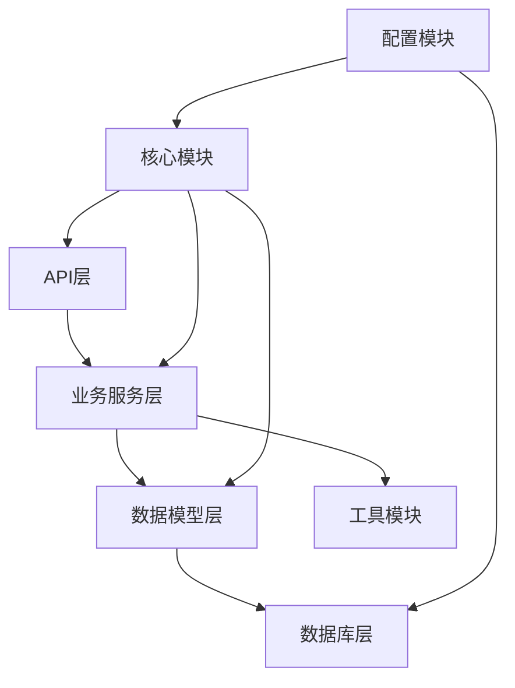

# CoachAI 技术架构概要设计（Tornado版）

## 📋 文档信息

| 项目 | 内容 |
|------|------|
| **文档名称** | CoachAI 技术架构概要设计 |
| **文档版本** | 3.1.0 |
| **创建日期** | 2026-03-26 |
| **最后更新** | 2026-03-26 |
| **文档状态** | 正式版 |
| **作者** | CoachAI-RD (后端研发专家) |
| **审核人** | 待定 |
| **开源许可证** | GPL V3 (所有衍生代码需保持开源) |
| **关联文档** | [CoachAI业务需求文档（BRD）.md](../pm/CoachAI业务需求文档（BRD）.md), [CoachAI产品需求文档（PRD）.md](../pm/CoachAI产品需求文档（PRD）.md) |
| **目标读者** | 技术团队、产品团队、测试团队 |

## 📝 修订历史

| 版本 | 日期 | 作者 | 变更描述 |
|------|------|------|----------|
| 1.0.0 | 2026-03-21 | baofengbaofeng | 初始版本创建 (简化架构) |
| 2.0.0 | 2026-03-26 | CoachAI-RD | 基于新需求重构：SaaS多租户、移动端H5、硬件外设集成 |
| 3.0.0 | 2026-03-26 | CoachAI-RD | 技术栈重构：Python 3.12 + Tornado + MySQL，MVP优化 |

## 🎯 技术栈变更摘要

### 1. 后端技术栈重构
- **编程语言**：Python 3.12（使用venv虚拟环境）
- **Web框架**：Tornado（异步高性能Web框架）
- **数据库**：MySQL 5.8（关系型数据库，当前环境支持版本）
- **ORM框架**：SQLAlchemy + Alembic（数据库迁移）
- **API规范**：OpenAPI 3.0 + Swagger UI

### 2. MVP开发优化原则
- **简化架构**：MVP阶段尽量少引入中间件
- **Python优先**：能在Python+MySQL体系内完成的不用中间件
- **渐进增强**：随着业务增长逐步引入Redis、MQ等中间件
- **性能平衡**：在开发效率和系统性能间取得平衡

### 3. 前端技术栈优化
- **移动端H5优先**：选择对移动端H5支持优秀的框架
- **性能优化**：针对移动端网络和设备进行深度优化
- **PWA支持**：支持渐进式Web应用特性
- **硬件访问**：优化移动端摄像头和麦克风访问体验

## 📊 目录

1. [架构设计原则](#1-架构设计原则)
2. [整体架构概述](#2-整体架构概述)
3. [技术栈选型对比](#3-技术栈选型对比)
4. [SaaS多租户架构设计](#4-saas多租户架构设计)
5. [移动端H5技术方案](#5-移动端h5技术方案)
6. [硬件外设集成方案](#6-硬件外设集成方案)
7. [系统模块划分](#7-系统模块划分)
8. [数据架构设计](#8-数据架构设计)
9. [部署架构设计](#9-部署架构设计)
10. [性能优化策略](#10-性能优化策略)
11. [扩展性设计](#11-扩展性设计)
12. [落地路径规划](#12-落地路径规划)

---

## 1. 架构设计原则

### 1.1 核心设计原则

#### 1.1.1 MVP简化原则
- **最小可行产品**：聚焦核心功能，快速验证市场
- **技术债务可控**：合理的技术债务，便于后续重构
- **渐进式增强**：随着用户增长逐步优化架构
- **成本效益平衡**：在开发成本和系统性能间取得平衡

#### 1.1.2 Python优先原则
- **语言一致性**：统一使用Python技术栈
- **开发效率**：利用Python生态快速开发
- **维护成本**：降低技术栈复杂度，便于维护
- **人才储备**：Python开发人才相对丰富

#### 1.1.3 异步高性能原则
- **Tornado优势**：利用Tornado的异步非阻塞特性
- **连接复用**：高效处理大量并发连接
- **资源节约**：减少线程/进程切换开销
- **实时性**：适合硬件外设的实时数据流

### 1.2 技术选型原则

#### 1.2.1 成熟稳定
- **生产验证**：选择经过大规模生产验证的技术
- **社区活跃**：选择有活跃社区支持的技术
- **文档完善**：选择有完善文档的技术
- **生态丰富**：选择生态丰富的技术栈

#### 1.2.4 代码规范要求
- **编码规范**：所有前后端代码必须严格遵循`.rules/coding-style.md`文件定义的规则
- **注释规范**：所有代码注释必须使用中文编写，确保团队理解一致
- **命名规范**：遵循统一的命名约定，提高代码可读性
- **质量检查**：建立代码审查机制，确保代码规范执行

#### 1.2.2 开发效率
- **开发体验**：提供良好的开发体验和调试支持
- **部署简单**：部署流程简单明了，降低运维成本
- **维护成本**：长期维护成本可控，便于团队接手
- **学习曲线**：技术栈学习曲线平缓，便于团队成长

#### 1.2.3 扩展性
- **水平扩展**：支持水平扩展应对用户增长
- **垂直扩展**：支持垂直扩展提升单机性能
- **功能扩展**：支持新功能快速迭代和集成
- **技术演进**：支持技术栈平滑演进和升级

## 2. 整体架构概述

### 2.1 架构视图

#### 2.1.1 逻辑架构
```
┌─────────────────────────────────────────────────────────┐
│                   移动端H5客户端层                       │
│  ┌─────────────┐  ┌─────────────┐  ┌─────────────┐    │
│  │   Vue 3 PWA │  │ 微信浏览器  │  │ 其他浏览器  │    │
│  │  (TypeScript)│  │  (H5页面)  │  │  (H5页面)   │    │
│  └─────────────┘  └─────────────┘  └─────────────┘    │
└─────────────────────────────────────────────────────────┘
                    │ HTTP/WebSocket/WebRTC
┌─────────────────────────────────────────────────────────┐
│                SaaS多租户后端服务层                       │
│  ┌──────────────────────────────────────────────────┐   │
│  │              Tornado异步应用                     │   │
│  │  ┌─────────────┐ ┌─────────────┐ ┌───────────┐  │   │
│  │  │ 租户管理    │ │ 硬件集成    │ │ AI服务    │  │   │
│  │  │ (多租户路由)│ │ (WebRTC/    │ │ (MediaPipe│  │   │
│  │  │             │ │  Web Audio) │ │ /Whisper) │  │   │
│  │  └─────────────┘ └─────────────┘ └───────────┘  │   │
│  │  ┌─────────────┐ ┌─────────────┐ ┌───────────┐  │   │
│  │  │ 家庭管理    │ │ 运动管理    │ │ 任务系统  │  │   │
│  │  │ (家庭成员)  │ │ (实时训练)  │ │ (成就)    │  │   │
│  │  └─────────────┘ └─────────────┘ └───────────┘  │   │
│  └──────────────────────────────────────────────────┘   │
└─────────────────────────────────────────────────────────┘
                    │
┌─────────────────────────────────────────────────────────┐
│                   数据存储层                             │
│  ┌─────────────┐  ┌─────────────┐  ┌─────────────┐    │
│  │   MySQL 5.8 │  │  本地缓存   │  │   MinIO     │    │
│  │ (多租户隔离)│  │  (内存缓存) │  │ (文件存储)  │    │
│  └─────────────┘  └─────────────┘  └─────────────┘    │
└─────────────────────────────────────────────────────────┘
```

#### 2.1.2 数据流架构
```
移动端H5 → WebRTC音视频流 → Tornado AI处理 → 实时反馈
        ↓
家庭租户请求 → 租户路由 → 异步业务处理 → MySQL操作
        ↓
硬件设备 → WebRTC连接 → 权限验证 → 功能调用
```

### 2.2 核心组件说明

#### 2.2.1 移动端H5客户端
- **Vue 3 PWA**：提供类原生App体验，对移动端H5支持优秀
- **WebRTC集成**：摄像头和麦克风访问，实时音视频通信
- **离线功能**：基础功能离线可用，提升用户体验
- **移动优化**：针对移动端进行深度性能优化和适配

#### 2.2.2 SaaS多租户后端
- **Tornado框架**：异步非阻塞Web框架，高性能处理并发
- **租户路由**：基于子域名或请求头的租户路由机制
- **数据隔离**：数据库Schema级或表级租户数据隔离
- **异步处理**：利用Python asyncio处理高并发请求

#### 2.2.3 硬件集成服务
- **WebRTC服务**：基于Tornado的WebRTC信令服务器
- **设备管理**：硬件设备检测、管理和状态监控
- **权限控制**：摄像头、麦克风等硬件访问权限控制
- **质量监控**：音视频质量监控和自适应调整

#### 2.2.4 AI服务层
- **MediaPipe集成**：动作识别和分析，支持实时处理
- **Whisper集成**：语音识别和处理，支持多语言
- **OCR服务**：作业图像文字识别和批改
- **实时分析**：实时运动数据分析和姿势纠正

## 3. 技术栈选型对比

### 3.1 后端框架选型对比

| 方案 | 技术栈 | 优点 | 缺点 | 选择理由 |
|------|--------|------|------|----------|
| **方案A** | Tornado + Python 3.12 | 1. 异步高性能<br>2. 轻量级<br>3. WebSocket原生支持<br>4. 适合实时应用 | 1. 生态相对较小<br>2. ORM支持需要集成 | ✅ **选择**：适合实时硬件集成 |
| **方案B** | Django + Django Channels | 1. 生态丰富<br>2. ORM强大<br>3. 管理后台完善 | 1. 同步框架为主<br>2. 实时性不如Tornado | ❌ 不选：实时性不足 |
| **方案C** | FastAPI + Uvicorn | 1. 性能优秀<br>2. 类型提示完善<br>3. 自动文档生成 | 1. WebSocket需要额外配置<br>2. 相对较新 | ❌ 不选：WebSocket支持不如Tornado |

**最终选择**: **Tornado 6.3 + Python 3.12**
- 异步非阻塞，适合高并发实时应用
- 原生WebSocket支持，适合硬件实时通信
- 轻量级，启动快速，资源占用少
- 成熟稳定，经过大规模生产验证

### 3.2 数据库选型对比

| 方案 | 数据库 | 优点 | 缺点 | 选择理由 |
|------|--------|------|------|----------|
| **方案A** | MySQL 5.8 | 1. 成熟稳定<br>2. 生态丰富<br>3. 工具完善<br>4. 成本可控 | 1. 水平扩展复杂<br>2.  JSON支持有限 | ✅ **选择**：成熟稳定，成本可控 |
| **方案B** | PostgreSQL 15 | 1. JSON支持好<br>2. 功能丰富<br>3. 扩展性强 | 1. 运维相对复杂<br>2. 云服务成本较高 | ❌ 不选：成本较高，MVP阶段不必要 |
| **方案C** | SQLite | 1. 零配置<br>2. 单文件<br>3. 开发简单 | 1. 并发性能差<br>2. 不适合生产 | ❌ 不选：不适合SaaS多租户 |

**最终选择**: **MySQL 5.8 + SQLAlchemy + Alembic**
- MySQL成熟稳定，运维成本低
- SQLAlchemy提供ORM和连接池管理
- Alembic提供数据库迁移管理
- 支持多租户数据隔离方案

### 3.3 前端框架选型对比

| 方案 | 技术栈 | 优点 | 缺点 | 选择理由 |
|------|--------|------|------|----------|
| **方案A** | Vue 3 + TypeScript + Vite | 1. 学习曲线平缓<br>2. 移动端支持好<br>3. 生态丰富<br>4. 性能优秀 | 1. 企业级案例相对较少 | ✅ **选择**：移动端H5支持优秀 |
| **方案B** | React 18 + TypeScript + Vite | 1. 生态最丰富<br>2. 企业应用多<br>3. 性能优秀 | 1. 学习曲线较陡<br>2. 包体积较大 | ❌ 不选：学习成本较高 |
| **方案C** | Svelte + Vite | 1. 包体积最小<br>2. 编译时优化<br>3. 开发体验好 | 1. 生态不成熟<br>2. 企业案例少 | ❌ 不选：生态不成熟 |

**最终选择**: **Vue 3 + TypeScript + Vite + PWA**
- Vue 3对移动端H5支持优秀，学习曲线平缓
- TypeScript提供类型安全，减少运行时错误
- Vite提供优秀的开发体验和构建性能
- PWA支持离线功能和类原生体验

### 3.4 缓存方案选型对比

| 方案 | 技术 | 优点 | 缺点 | 选择理由 |
|------|------|------|------|----------|
| **方案A** | 内存缓存（Python dict） | 1. 零依赖<br>2. 性能极高<br>3. 实现简单 | 1. 重启丢失<br>2. 单机限制<br>3. 内存管理复杂 | ✅ **选择（MVP阶段）**：简单快速 |
| **方案B** | Redis | 1. 功能丰富<br>2. 持久化支持<br>3. 分布式支持 | 1. 引入中间件<br>2. 运维成本<br>3. 网络开销 | ❌ 不选（MVP阶段）：过度设计 |
| **方案C** | Memcached | 1. 简单高效<br>2. 分布式支持 | 1. 功能有限<br>2. 需要额外维护 | ❌ 不选：功能不如Redis |

**MVP阶段选择**: **Python内存缓存 + 后期升级Redis**
- MVP阶段使用Python内存缓存，简单快速
- 后期用户量增长后平滑迁移到Redis
- 通过抽象缓存接口，实现无缝切换

## 4. SaaS多租户架构设计

### 4.1 多租户实现方案

#### 4.1.1 数据库表级隔离设计
```python
# 数据库表设计：通过tenant_id字段实现多租户数据隔离
# 所有租户共享的表结构，通过tenant_id区分不同租户数据
# 所有表名使用统一前缀：coach_ai_

# 租户表
CREATE TABLE coach_ai_tenants (
    id BIGINT AUTO_INCREMENT PRIMARY KEY,
    uuid VARCHAR(36) NOT NULL UNIQUE COMMENT '租户唯一标识',
    name VARCHAR(100) NOT NULL COMMENT '租户名称（家庭名称）',
    family_type ENUM('core', 'couple', 'extended', 'single') NOT NULL COMMENT '家庭类型',
    max_members INT NOT NULL DEFAULT 5 COMMENT '最大成员数量',
    subscription_plan ENUM('basic', 'premium', 'professional') NOT NULL COMMENT '订阅计划',
    subscription_status ENUM('active', 'suspended', 'cancelled') NOT NULL DEFAULT 'active' COMMENT '订阅状态',
    created_at TIMESTAMP DEFAULT CURRENT_TIMESTAMP COMMENT '创建时间',
    updated_at TIMESTAMP DEFAULT CURRENT_TIMESTAMP ON UPDATE CURRENT_TIMESTAMP COMMENT '更新时间',
    INDEX idx_uuid (uuid),
    INDEX idx_subscription_status (subscription_status)
) ENGINE=InnoDB DEFAULT CHARSET=utf8mb4 COLLATE=utf8mb4_unicode_ci COMMENT='租户（家庭）信息表';

# 家庭成员表（包含tenant_id字段）
CREATE TABLE coach_ai_family_members (
    id BIGINT AUTO_INCREMENT PRIMARY KEY,
    tenant_id BIGINT NOT NULL COMMENT '租户ID',
    user_id BIGINT NOT NULL COMMENT '用户ID',
    role ENUM('admin', 'adult', 'teenager', 'child', 'elder') NOT NULL COMMENT '成员角色',
    relationship VARCHAR(50) COMMENT '家庭关系',
    permissions JSON COMMENT '权限配置',
    created_at TIMESTAMP DEFAULT CURRENT_TIMESTAMP COMMENT '创建时间',
    updated_at TIMESTAMP DEFAULT CURRENT_TIMESTAMP ON UPDATE CURRENT_TIMESTAMP COMMENT '更新时间',
    UNIQUE KEY uk_tenant_user (tenant_id, user_id),
    INDEX idx_tenant_id (tenant_id),
    INDEX idx_user_id (user_id)
) ENGINE=InnoDB DEFAULT CHARSET=utf8mb4 COLLATE=utf8mb4_unicode_ci COMMENT='家庭成员关联表';

# 用户表
CREATE TABLE coach_ai_users (
    id BIGINT AUTO_INCREMENT PRIMARY KEY,
    uuid VARCHAR(36) NOT NULL UNIQUE COMMENT '用户唯一标识',
    email VARCHAR(255) UNIQUE COMMENT '邮箱',
    phone VARCHAR(20) UNIQUE COMMENT '手机号',
    username VARCHAR(50) UNIQUE COMMENT '用户名',
    password_hash VARCHAR(255) NOT NULL COMMENT '密码哈希',
    salt VARCHAR(32) NOT NULL COMMENT '密码盐值',
    nickname VARCHAR(50) COMMENT '昵称',
    real_name VARCHAR(50) COMMENT '真实姓名',
    avatar_url VARCHAR(500) COMMENT '头像URL',
    gender ENUM('male', 'female', 'other') COMMENT '性别',
    birth_date DATE COMMENT '出生日期',
    is_active BOOLEAN NOT NULL DEFAULT TRUE COMMENT '是否激活',
    is_verified BOOLEAN NOT NULL DEFAULT FALSE COMMENT '是否已验证',
    last_login_at TIMESTAMP NULL COMMENT '最后登录时间',
    created_at TIMESTAMP DEFAULT CURRENT_TIMESTAMP COMMENT '创建时间',
    updated_at TIMESTAMP DEFAULT CURRENT_TIMESTAMP ON UPDATE CURRENT_TIMESTAMP COMMENT '更新时间',
    INDEX idx_uuid (uuid),
    INDEX idx_email (email),
    INDEX idx_phone (phone),
    INDEX idx_username (username)
) ENGINE=InnoDB DEFAULT CHARSET=utf8mb4 COLLATE=utf8mb4_unicode_ci COMMENT='系统用户表';
```

#### 4.1.2 数据访问层设计
```python
# 基础数据访问类，自动处理tenant_id过滤
class TenantAwareRepository:
    """租户感知的数据访问基类，自动处理多租户数据隔离"""
    
    def __init__(self, tenant_id: int):
        self.tenant_id = tenant_id
    
    def get_by_id(self, model_class, object_id: int):
        """根据ID获取对象，自动添加tenant_id过滤"""
        return session.query(model_class).filter(
            model_class.id == object_id,
            model_class.tenant_id == self.tenant_id
        ).first()
    
    def get_all(self, model_class, **filters):
        """获取所有对象，自动添加tenant_id过滤"""
        query = session.query(model_class).filter(
            model_class.tenant_id == self.tenant_id
        )
        for key, value in filters.items():
            query = query.filter(getattr(model_class, key) == value)
        return query.all()
    
    def create(self, model_class, **data):
        """创建对象，自动设置tenant_id"""
        data['tenant_id'] = self.tenant_id
        obj = model_class(**data)
        session.add(obj)
        session.commit()
        return obj

# 使用示例
class HomeworkRepository(TenantAwareRepository):
    """作业数据访问类"""
    
    def get_pending_homeworks(self):
        """获取待处理的作业"""
        return self.get_all(HomeworkModel, status='pending')
    
    def get_by_student(self, student_id: int):
        """根据学生ID获取作业"""
        return session.query(HomeworkModel).filter(
            HomeworkModel.tenant_id == self.tenant_id,
            HomeworkModel.student_id == student_id
        ).all()
```

#### 4.1.3 租户上下文管理
```python
# 租户上下文管理器，确保所有操作都在正确的租户上下文中
class TenantContext:
    """租户上下文管理器，用于管理当前租户上下文"""
    
    def __init__(self):
        self.current_tenant = None
    
    def set_tenant(self, tenant_id: int):
        """设置当前租户"""
        self.current_tenant = tenant_id
    
    def get_tenant(self) -> Optional[int]:
        """获取当前租户"""
        return self.current_tenant
    
    def ensure_tenant(self):
        """确保当前有租户上下文"""
        if not self.current_tenant:
            raise TenantContextError("未设置租户上下文")

# 中间件：自动从请求中提取租户信息
class TenantMiddleware:
    """租户中间件，自动从请求中提取租户信息"""
    
    def __init__(self, app):
        self.app = app
    
    async def __call__(self, request):
        # 从请求头或URL参数中提取租户ID
        tenant_id = self.extract_tenant_id(request)
        if tenant_id:
            tenant_context.set_tenant(tenant_id)
        
        try:
            response = await self.app(request)
            return response
        finally:
            # 清理租户上下文
            tenant_context.set_tenant(None)
    
    def extract_tenant_id(self, request) -> Optional[int]:
        """从请求中提取租户ID"""
        # 从请求头中提取
        tenant_id = request.headers.get('X-Tenant-ID')
        if tenant_id:
            return int(tenant_id)
        
        # 从URL参数中提取
        tenant_id = request.query.get('tenant_id')
        if tenant_id:
            return int(tenant_id)
        
        # 从JWT Token中提取
        token = request.headers.get('Authorization')
        if token and token.startswith('Bearer '):
            payload = jwt.decode(token[7:], SECRET_KEY, algorithms=['HS256'])
            return payload.get('tenant_id')
        
        return None
```

### 4.2 租户生命周期管理

#### 4.2.1 租户创建流程
```python
# 租户创建服务
class TenantService:
    """租户管理服务，处理租户的完整生命周期"""
    
    def create_tenant(self, name: str, family_type: str, admin_user_id: int) -> Tenant:
        """创建新租户"""
        # 1. 创建租户记录
        tenant = Tenant(
            uuid=str(uuid.uuid4()),
            name=name,
            family_type=family_type,
            subscription_plan='basic',
            subscription_status='active'
        )
        session.add(tenant)
        session.flush()  # 获取租户ID
        
        # 2. 创建默认管理员成员
        admin_member = FamilyMember(
            tenant_id=tenant.id,
            user_id=admin_user_id,
            role='admin',
            relationship='admin',
            permissions={'all': True}
        )
        session.add(admin_member)
        
        # 3. 创建默认配置
        self.create_default_config(tenant.id)
        
        # 4. 初始化数据
        self.initialize_tenant_data(tenant.id)
        
        session.commit()
        return tenant
    
    def create_default_config(self, tenant_id: int):
        """创建租户默认配置"""
        config = TenantConfig(
            tenant_id=tenant_id,
            settings={
                'language': 'zh-CN',
                'timezone': 'Asia/Shanghai',
                'notification_enabled': True,
                'homework_auto_correction': True,
                'exercise_auto_counting': True
            }
        )
        session.add(config)
    
    def initialize_tenant_data(self, tenant_id: int):
        """初始化租户数据"""
        # 创建默认成就模板
        self.create_default_achievements(tenant_id)
        # 创建默认运动类型
        self.create_default_exercise_types(tenant_id)
```

#### 4.2.2 租户配额管理
```python
# 租户配额管理
class TenantQuotaManager:
    """租户配额管理器，监控和管理租户资源使用"""
    
    def __init__(self, tenant_id: int):
        self.tenant_id = tenant_id
    
    def check_storage_quota(self, file_size: int) -> bool:
        """检查存储配额"""
        tenant = session.query(Tenant).filter(Tenant.id == self.tenant_id).first()
        if not tenant:
            return False
        
        # 计算已使用存储
        used_storage = self.calculate_used_storage()
        
        # 检查是否超过配额
        return (used_storage + file_size) <= tenant.storage_quota
    
    def calculate_used_storage(self) -> int:
        """计算已使用的存储空间"""
        # 计算作业图片存储
        homework_storage = session.query(
            func.sum(Homework.image_size)
        ).filter(
            Homework.tenant_id == self.tenant_id
        ).scalar() or 0
        
        # 计算运动视频存储
        exercise_storage = session.query(
            func.sum(ExerciseRecord.video_size)
        ).filter(
            ExerciseRecord.tenant_id == self.tenant_id
        ).scalar() or 0
        
        return homework_storage + exercise_storage
    
    def check_member_quota(self) -> bool:
        """检查成员数量配额"""
        tenant = session.query(Tenant).filter(Tenant.id == self.tenant_id).first()
        if not tenant:
            return False
        
        # 计算当前成员数量
        member_count = session.query(FamilyMember).filter(
            FamilyMember.tenant_id == self.tenant_id,
            FamilyMember.is_active == True
        ).count()
        
        return member_count < tenant.max_members
```

### 4.3 数据隔离安全性

#### 4.3.1 数据访问安全策略
1. **强制租户过滤**：所有数据查询必须包含tenant_id过滤条件
2. **中间件验证**：通过中间件确保每个请求都有正确的租户上下文
3. **API网关控制**：在API网关层验证租户权限
4. **数据库视图隔离**：为每个租户创建数据库视图，实现物理隔离

#### 4.3.2 安全审计日志
```python
# 租户操作审计日志
class TenantAuditLogger:
    """租户操作审计日志记录器"""
    
    def log_operation(self, tenant_id: int, user_id: int, operation: str, details: dict):
        """记录租户操作日志"""
        audit_log = TenantAuditLog(
            tenant_id=tenant_id,
            user_id=user_id,
            operation=operation,
            details=details,
            ip_address=request.remote_ip,
            user_agent=request.headers.get('User-Agent')
        )
        session.add(audit_log)
        session.commit()
    
    def get_audit_logs(self, tenant_id: int, start_date=None, end_date=None):
        """获取租户审计日志"""
        query = session.query(TenantAuditLog).filter(
            TenantAuditLog.tenant_id == tenant_id
        )
        
        if start_date:
            query = query.filter(TenantAuditLog.created_at >= start_date)
        if end_date:
            query = query.filter(TenantAuditLog.created_at <= end_date)
        
        return query.order_by(TenantAuditLog.created_at.desc()).all()
```

## 5. 移动端H5技术方案

### 5.1 前端技术栈选择

#### 5.1.1 Vue 3 + TypeScript技术栈
```json
// package.json 核心依赖配置
{
  "dependencies": {
    "vue": "^3.4.0",
    "vue-router": "^4.2.0",
    "pinia": "^2.1.0",
    "axios": "^1.6.0",
    "element-plus": "^2.4.0",
    "@element-plus/icons-vue": "^2.3.0"
  },
  "devDependencies": {
    "typescript": "^5.3.0",
    "vite": "^5.0.0",
    "@vitejs/plugin-vue": "^4.5.0",
    "@vitejs/plugin-vue-jsx": "^3.0.0",
    "vite-plugin-pwa": "^0.17.0",
    "eslint": "^8.55.0",
    "prettier": "^3.1.0"
  }
}
```

#### 5.1.2 移动端适配方案
```vue
<!-- 移动端适配配置 -->
<!-- vite.config.ts -->
import { defineConfig } from 'vite'
import vue from '@vitejs/plugin-vue'
import { VitePWA } from 'vite-plugin-pwa'

export default defineConfig({
  plugins: [
    vue(),
    VitePWA({
      registerType: 'autoUpdate',
      includeAssets: ['favicon.ico', 'apple-touch-icon.png'],
      manifest: {
        name: 'CoachAI - 家庭教育管理平台',
        short_name: 'CoachAI',
        description: '帮助家长管理子女学习和运动的SaaS平台',
        theme_color: '#1890ff',
        background_color: '#ffffff',
        display: 'standalone',
        orientation: 'portrait',
        scope: '/',
        start_url: '/',
        icons: [
          {
            src: '/icon-192x192.png',
            sizes: '192x192',
            type: 'image/png'
          },
          {
            src: '/icon-512x512.png',
            sizes: '512x512',
            type: 'image/png'
          }
        ]
      }
    })
  ],
  css: {
    preprocessorOptions: {
      scss: {
        additionalData: `@import "@/styles/variables.scss";`
      }
    }
  },
  server: {
    host: '0.0.0.0',
    port: 3000,
    proxy: {
      '/api': {
        target: 'http://localhost:8000',
        changeOrigin: true
      }
    }
  }
})
```

### 5.2 移动端性能优化

#### 5.2.1 图片和资源优化
```javascript
// 图片懒加载和优化
import { createApp } from 'vue'
import App from './App.vue'
import { Lazyload } from 'vant'

const app = createApp(App)

// 配置图片懒加载
app.use(Lazyload, {
  lazyComponent: true,
  loading: '/images/loading.gif',
  error: '/images/error.png',
  preLoad: 1.3,
  attempt: 3
})

// 图片压缩和格式转换
export function optimizeImage(file: File): Promise<Blob> {
  return new Promise((resolve, reject) => {
    const reader = new FileReader()
    reader.onload = (e) => {
      const img = new Image()
      img.onload = () => {
        const canvas = document.createElement('canvas')
        const ctx = canvas.getContext('2d')
        
        // 计算新尺寸（最大宽度800px）
        let width = img.width
        let height = img.height
        const maxWidth = 800
        
        if (width > maxWidth) {
          height = (height * maxWidth) / width
          width = maxWidth
        }
        
        canvas.width = width
        canvas.height = height
        
        // 绘制并压缩
        ctx?.drawImage(img, 0, 0, width, height)
        canvas.toBlob(
          (blob) => {
            if (blob) {
              resolve(blob)
            } else {
              reject(new Error('图片压缩失败'))
            }
          },
          'image/jpeg',
          0.8 // 质量参数
        )
      }
      img.src = e.target?.result as string
    }
    reader.readAsDataURL(file)
  })
}
```

#### 5.2.2 网络请求优化
```typescript
// 网络请求优化配置
import axios from 'axios'
import { ElMessage } from 'element-plus'

// 创建axios实例
const service = axios.create({
  baseURL: import.meta.env.VITE_API_BASE_URL || '/api/v1',
  timeout: 30000, // 30秒超时
  headers: {
    'Content-Type': 'application/json;charset=utf-8'
  }
})

// 请求拦截器
service.interceptors.request.use(
  (config) => {
    // 添加认证token
    const token = localStorage.getItem('access_token')
    if (token) {
      config.headers.Authorization = `Bearer ${token}`
    }
    
    // 添加租户ID
    const tenantId = localStorage.getItem('current_tenant_id')
    if (tenantId) {
      config.headers['X-Tenant-ID'] = tenantId
    }
    
    return config
  },
  (error) => {
    return Promise.reject(error)
  }
)

// 响应拦截器
service.interceptors.response.use(
  (response) => {
    const res = response.data
    
    // 处理业务错误码
    if (res.code !== 'SUCCESS') {
      ElMessage.error(res.message || '请求失败')
      return Promise.reject(new Error(res.message || 'Error'))
    }
    
    return res.data
  },
  (error) => {
    // 处理网络错误
    if (error.response) {
      switch (error.response.status) {
        case 401:
          // token过期，跳转到登录页
          localStorage.removeItem('access_token')
          window.location.href = '/login'
          break
        case 403:
          ElMessage.error('权限不足')
          break
        case 404:
          ElMessage.error('请求的资源不存在')
          break
        case 500:
          ElMessage.error('服务器内部错误')
          break
        default:
          ElMessage.error(error.response.data?.message || '请求失败')
      }
    } else if (error.request) {
      ElMessage.error('网络连接失败，请检查网络设置')
    } else {
      ElMessage.error('请求配置错误')
    }
    
    return Promise.reject(error)
  }
)

export default service
```

### 5.3 PWA特性实现

#### 5.3.1 Service Worker配置
```javascript
// public/sw.js - Service Worker主文件
const CACHE_NAME = 'coachai-v1'
const urlsToCache = [
  '/',
  '/index.html',
  '/manifest.json',
  '/icon-192x192.png',
  '/icon-512x512.png'
]

// 安装事件
self.addEventListener('install', (event) => {
  event.waitUntil(
    caches.open(CACHE_NAME).then((cache) => {
      return cache.addAll(urlsToCache)
    })
  )
})

// 激活事件
self.addEventListener('activate', (event) => {
  event.waitUntil(
    caches.keys().then((cacheNames) => {
      return Promise.all(
        cacheNames.map((cacheName) => {
          if (cacheName !== CACHE_NAME) {
            return caches.delete(cacheName)
          }
        })
      )
    })
  )
})

// 请求拦截
self.addEventListener('fetch', (event) => {
  event.respondWith(
    caches.match(event.request).then((response) => {
      // 缓存优先，网络回退
      return response || fetch(event.request)
    })
  )
})

// 后台同步
self.addEventListener('sync', (event) => {
  if (event.tag === 'sync-homework') {
    event.waitUntil(syncHomeworkData())
  }
})

async function syncHomeworkData() {
  // 同步作业数据
  const db = await openDatabase()
  const pendingHomeworks = await db.getAll('pending_homeworks')
  
  for (const homework of pendingHomeworks) {
    try {
      await fetch('/api/v1/homeworks', {
        method: 'POST',
        headers: {
          'Content-Type': 'application/json',
          'Authorization': `Bearer ${localStorage.getItem('access_token')}`
        },
        body: JSON.stringify(homework)
      })
      
      // 同步成功后从本地存储中删除
      await db.delete('pending_homeworks', homework.id)
    } catch (error) {
      console.error('同步作业数据失败:', error)
    }
  }
}
```

#### 5.3.2 离线功能实现
```typescript
// 离线数据管理
class OfflineDataManager {
  private db: IDBDatabase | null = null
  
  constructor() {
    this.initDatabase()
  }
  
  private async initDatabase(): Promise<void> {
    return new Promise((resolve, reject) => {
      const request = indexedDB.open('coachai_offline', 1)
      
      request.onerror = () => reject(request.error)
      request.onsuccess = () => {
        this.db = request.result
        resolve()
      }
      
      request.onupgradeneeded = (event) => {
        const db = (event.target as IDBOpenDBRequest).result
        
        // 创建作业存储
        if (!db.objectStoreNames.contains('homeworks')) {
          const store = db.createObjectStore('homeworks', { keyPath: 'id' })
          store.createIndex('status', 'status', { unique: false })
          store.createIndex('created_at', 'created_at', { unique: false })
        }
        
        // 创建运动记录存储
        if (!db.objectStoreNames.contains('exercises')) {
          const store = db.createObjectStore('exercises', { keyPath: 'id' })
          store.createIndex('type', 'type', { unique: false })
          store.createIndex('date', 'date', { unique: false })
        }
      }
    })
  }
  
  // 保存作业数据
  async saveHomework(homework: HomeworkData): Promise<void> {
    if (!this.db) throw new Error('数据库未初始化')
    
    return new Promise((resolve, reject) => {
      const transaction = this.db!.transaction(['homeworks'], 'readwrite')
      const store = transaction.objectStore('homeworks')
      const request = store.put({
        ...homework,
        sync_status: 'pending',
        created_at: new Date().toISOString()
      })
      
      request.onsuccess = () => resolve()
      request.onerror = () => reject(request.error)
    })
  }
  
  // 获取待同步的作业
  async getPendingHomeworks(): Promise<HomeworkData[]> {
    if (!this.db) throw new Error('数据库未初始化')
    
    return new Promise((resolve, reject) => {
      const transaction = this.db!.transaction(['homeworks'], 'readonly')
      const store = transaction.objectStore('homeworks')
      const index = store.index('sync_status')
      const request = index.getAll('pending')
      
      request.onsuccess = () => resolve(request.result)
      request.onerror = () => reject(request.error)
    })
  }
}
```

### 5.4 移动端硬件访问

#### 5.4.1 摄像头访问
```vue
<!-- 摄像头访问组件 -->
<template>
  <div class="camera-container">
    <video ref="videoRef" autoplay playsinline></video>
    <div class="controls">
      <button @click="startCamera">开启摄像头</button>
      <button @click="takePhoto">拍照</button>
      <button @click="stopCamera">关闭摄像头</button>
    </div>
    <canvas ref="canvasRef" style="display: none;"></canvas>
  </div>
</template>

<script setup lang="ts">
import { ref, onUnmounted } from 'vue'

const videoRef = ref<HTMLVideoElement>()
const canvasRef = ref<HTMLCanvasElement>()
let stream: MediaStream | null = null

// 开启摄像头
const startCamera = async () => {
  try {
    // 请求摄像头权限
    stream = await navigator.mediaDevices.getUserMedia({
      video: {
        facingMode: 'environment', // 后置摄像头
        width: { ideal: 1280 },
        height: { ideal: 720 }
      },
      audio: false
    })
    
    if (videoRef.value) {
      videoRef.value.srcObject = stream
    }
  } catch (error) {
    console.error('摄像头访问失败:', error)
    alert('无法访问摄像头，请检查权限设置')
  }
}

// 拍照
const takePhoto = () => {
  if (!videoRef.value || !canvasRef.value) return
  
  const video = videoRef.value
  const canvas = canvasRef.value
  
  // 设置canvas尺寸与视频一致
  canvas.width = video.videoWidth
  canvas.height = video.videoHeight
  
  // 绘制图像
  const ctx = canvas.getContext('2d')
  if (ctx) {
    ctx.drawImage(video, 0, 0, canvas.width, canvas.height)
    
    // 获取图片数据
    const imageData = canvas.toDataURL('image/jpeg', 0.8)
    
    // 触发拍照事件
    emit('photo-taken', imageData)
  }
}

// 关闭摄像头
const stopCamera = () => {
  if (stream) {
    stream.getTracks().forEach(track => track.stop())
    stream = null
  }
  
  if (videoRef.value) {
    videoRef.value.srcObject = null
  }
}

// 组件卸载时清理
onUnmounted(() => {
  stopCamera()
})
</script>

<style scoped>
.camera-container {
  position: relative;
  width: 100%;
  max-width: 500px;
  margin: 0 auto;
}

video {
  width: 100%;
  height: auto;
  border-radius: 8px;
  background: #000;
}

.controls {
  margin-top: 16px;
  display: flex;
  gap: 12px;
  justify-content: center;
}

button {
  padding: 12px 24px;
  background: #1890ff;
  color: white;
  border: none;
  border-radius: 4px;
  cursor: pointer;
  font-size: 16px;
}

button:hover {
  background: #40a9ff;
}
</style>
```

#### 5.4.2 麦克风访问
```typescript
// 麦克风访问工具类
class MicrophoneManager {
  private stream: MediaStream | null = null
  private audioContext: AudioContext | null = null
  private analyser: AnalyserNode | null = null
  private isRecording = false
  private audioChunks: Blob[] = []
  private mediaRecorder: MediaRecorder | null = null
  
  // 请求麦克风权限
  async requestPermission(): Promise<boolean> {
    try {
      this.stream = await navigator.mediaDevices.getUserMedia({
        audio: {
          echoCancellation: true,
          noiseSuppression: true,
          sampleRate: 44100
        }
      })
      return true
    } catch (error) {
      console.error('麦克风权限请求失败:', error)
      return false
    }
  }
  
  // 开始录音
  startRecording(): void {
    if (!this.stream) {
      throw new Error('请先请求麦克风权限')
    }
    
    this.audioChunks = []
    this.mediaRecorder = new MediaRecorder(this.stream)
    
    this.mediaRecorder.ondataavailable = (event) => {
      if (event.data.size > 0) {
        this.audioChunks.push(event.data)
      }
    }
    
    this.mediaRecorder.onstop = () => {
      const audioBlob = new Blob(this.audioChunks, { type: 'audio/webm' })
      this.onRecordingComplete(audioBlob)
    }
    
    this.mediaRecorder.start()
    this.isRecording = true
  }
  
  // 停止录音
  stopRecording(): void {
    if (this.mediaRecorder && this.isRecording) {
      this.mediaRecorder.stop()
      this.isRecording = false
    }
  }
  
  // 获取音频数据
  getAudioData(): Promise<Blob> {
    return new Promise((resolve) => {
      if (this.audioChunks.length === 0) {
        resolve(new Blob())
        return
      }
      
      const audioBlob = new Blob(this.audioChunks, { type: 'audio/webm' })
      resolve(audioBlob)
    })
  }
  
  // 清理资源
  cleanup(): void {
    if (this.stream) {
      this.stream.getTracks().forEach(track => track.stop())
      this.stream = null
    }
    
    if (this.audioContext) {
      this.audioContext.close()
      this.audioContext = null
    }
    
    this.analyser = null
    this.isRecording = false
    this.audioChunks = []
    this.mediaRecorder = null
  }
  
  // 录音完成回调
  private onRecordingComplete(audioBlob: Blob): void {
    // 触发录音完成事件
    const event = new CustomEvent('recording-complete', {
      detail: { audioBlob }
    })
    window.dispatchEvent(event)
  }
}
```

## 6. 硬件外设集成方案

### 6.1 WebRTC实时通信

#### 6.1.1 WebRTC配置
```python
# WebRTC服务配置
class WebRTCService:
    """WebRTC服务，处理实时音视频通信"""
    
    def __init__(self):
        self.peer_connections = {}
        self.data_channels = {}
        
    async def create_offer(self, client_id: str, tenant_id: int):
        """创建WebRTC Offer"""
        # 创建PeerConnection
        pc = RTCPeerConnection(self.get_rtc_config())
        
        # 添加本地媒体流
        if self.should_add_video(tenant_id):
            await self.add_video_track(pc, tenant_id)
        
        if self.should_add_audio(tenant_id):
            await self.add_audio_track(pc, tenant_id)
        
        # 创建数据通道
        dc = pc.createDataChannel('coachai-data')
        self.setup_data_channel(dc, client_id)
        
        # 创建Offer
        offer = await pc.createOffer()
        await pc.setLocalDescription(offer)
        
        # 保存连接
        self.peer_connections[client_id] = pc
        self.data_channels[client_id] = dc
        
        return {
            'sdp': pc.localDescription.sdp,
            'type': pc.localDescription.type
        }
    
    def get_rtc_config(self):
        """获取RTC配置"""
        return {
            'iceServers': [
                {
                    'urls': [
                        'stun:stun.l.google.com:19302',
                        'stun:stun1.l.google.com:19302'
                    ]
                }
            ],
            'iceCandidatePoolSize': 10
        }
    
    async def add_video_track(self, pc, tenant_id: int):
        """添加视频轨道"""
        # 这里可以根据租户配置决定视频质量
        constraints = self.get_video_constraints(tenant_id)
        
        try:
            stream = await navigator.mediaDevices.getUserMedia({
                'video': constraints
            })
            pc.addTrack(stream.getVideoTracks()[0], stream)
        except Exception as e:
            logger.error(f"添加视频轨道失败: {e}")
    
    def get_video_constraints(self, tenant_id: int):
        """获取视频约束条件"""
        # 根据租户订阅计划设置视频质量
        tenant = self.get_tenant_config(tenant_id)
        
        if tenant.subscription_plan == 'professional':
            return {
                'width': { ideal: 1920, max: 1920 },
                'height': { ideal: 1080, max: 1080 },
                'frameRate': { ideal: 30, max: 60 }
            }
        elif tenant.subscription_plan == 'premium':
            return {
                'width': { ideal: 1280, max: 1280 },
                'height': { ideal: 720, max: 720 },
                'frameRate': { ideal: 30, max: 30 }
            }
        else:  # basic
            return {
                'width': { ideal: 640, max: 640 },
                'height': { ideal: 480, max: 480 },
                'frameRate': { ideal: 15, max: 30 }
            }
```

#### 6.1.2 信令服务器
```python
# WebRTC信令服务器
class SignalingServer:
    """WebRTC信令服务器，处理客户端间的信令交换"""
    
    def __init__(self):
        self.clients = {}
        self.rooms = {}
        
    async def handle_connection(self, websocket, path):
        """处理WebSocket连接"""
        client_id = self.generate_client_id()
        self.clients[client_id] = websocket
        
        try:
            async for message in websocket:
                await self.handle_message(client_id, message)
        except websockets.exceptions.ConnectionClosed:
            await self.handle_disconnection(client_id)
    
    async def handle_message(self, client_id: str, message: str):
        """处理客户端消息"""
        data = json.loads(message)
        message_type = data.get('type')
        
        if message_type == 'join':
            await self.handle_join(client_id, data)
        elif message_type == 'offer':
            await self.handle_offer(client_id, data)
        elif message_type == 'answer':
            await self.handle_answer(client_id, data)
        elif message_type == 'ice-candidate':
            await self.handle_ice_candidate(client_id, data)
        elif message_type == 'leave':
            await self.handle_leave(client_id, data)
    
    async def handle_join(self, client_id: str, data: dict):
        """处理加入房间请求"""
        room_id = data['room_id']
        tenant_id = data['tenant_id']
        
        if room_id not in self.rooms:
            self.rooms[room_id] = {
                'clients': [],
                'tenant_id': tenant_id,
                'created_at': datetime.now()
            }
        
        # 添加客户端到房间
        self.rooms[room_id]['clients'].append(client_id)
        
        # 通知房间内其他客户端
        await self.broadcast_to_room(room_id, {
            'type': 'user-joined',
            'client_id': client_id,
            'timestamp': datetime.now().isoformat()
        }, exclude_client=client_id)
        
        # 发送加入成功响应
        await self.send_to_client(client_id, {
            'type': 'join-success',
            'room_id': room_id,
            'clients': self.rooms[room_id]['clients']
        })
```

### 6.2 实时运动识别

#### 6.2.1 运动识别服务
```python
# 实时运动识别服务
class ExerciseRecognitionService:
    """运动识别服务，实时分析运动动作"""
    
    def __init__(self):
        self.models = {}
        self.load_models()
    
    def load_models(self):
        """加载运动识别模型"""
        # 加载跳绳识别模型
        self.models['jump_rope'] = self.load_jump_rope_model()
        
        # 加载俯卧撑识别模型
        self.models['push_up'] = self.load_push_up_model()
        
        # 加载深蹲识别模型
        self.models['squat'] = self.load_squat_model()
    
    async def process_video_frame(self, frame_data: bytes, exercise_type: str, tenant_id: int):
        """处理视频帧，识别运动动作"""
        # 解码视频帧
        frame = self.decode_frame(frame_data)
        
        # 获取对应的模型
        model = self.models.get(exercise_type)
        if not model:
            raise ValueError(f"不支持的运动类型: {exercise_type}")
        
        # 运行模型推理
        result = await self.run_model_inference(model, frame)
        
        # 根据租户配置调整识别精度
        tenant_config = self.get_tenant_config(tenant_id)
        if tenant_config.get('high_accuracy_mode', False):
            result = self.enhance_accuracy(result)
        
        return {
            'count': result.get('count', 0),
            'posture_score': result.get('posture_score', 0),
            'feedback': result.get('feedback', ''),
            'timestamp': datetime.now().isoformat(),
            'confidence': result.get('confidence', 0)
        }
    
    def decode_frame(self, frame_data: bytes):
        """解码视频帧"""
        # 使用OpenCV解码
        import cv2
        import numpy as np
        
        nparr = np.frombuffer(frame_data, np.uint8)
        frame = cv2.imdecode(nparr, cv2.IMREAD_COLOR)
        
        if frame is None:
            raise ValueError("视频帧解码失败")
        
        return frame
    
    async def run_model_inference(self, model, frame):
        """运行模型推理"""
        # 这里使用异步执行，避免阻塞事件循环
        loop = asyncio.get_event_loop()
        result = await loop.run_in_executor(
            None,
            model.predict,
            frame
        )
        return result
```

#### 6.2.2 实时反馈系统
```python
# 实时运动反馈系统
class RealTimeFeedbackService:
    """实时运动反馈服务，提供即时指导"""
    
    def __init__(self):
        self.feedback_templates = self.load_feedback_templates()
        self.user_profiles = {}
    
    def load_feedback_templates(self):
        """加载反馈模板"""
        return {
            'jump_rope': {
                'good': [
                    "跳得很好！节奏很稳定",
                    "姿势标准，继续保持",
                    "手腕发力很到位"
                ],
                'improve': [
                    "尝试跳得更高一些",
                    "注意手腕的协调性",
                    "保持呼吸均匀"
                ],
                'warning': [
                    "速度有点快，注意安全",
                    "落地太重，对膝盖不好",
                    "绳子有点打结，检查一下"
                ]
            },
            'push_up': {
                'good': [
                    "胸部贴地很到位",
                    "身体保持一条直线",
                    "下降速度控制得很好"
                ],
                'improve': [
                    "臀部不要抬得太高",
                    "下降时肘部不要太开",
                    "注意呼吸节奏"
                ],
                'warning': [
                    "腰部有点塌，注意核心收紧",
                    "动作太快，容易受伤",
                    "手臂伸直时不要锁死肘关节"
                ]
            }
        }
    
    def generate_feedback(self, exercise_type: str, metrics: dict, user_id: int) -> str:
        """生成实时反馈"""
        # 获取用户历史数据
        user_history = self.get_user_history(user_id, exercise_type)
        
        # 分析当前指标
        analysis = self.analyze_metrics(metrics, user_history)
        
        # 选择反馈模板
        template_category = self.select_template_category(analysis)
        templates = self.feedback_templates[exercise_type][template_category]
        
        # 随机选择一个反馈
        import random
        feedback = random.choice(templates)
        
        # 个性化调整
        if user_history:
            feedback = self.personalize_feedback(feedback, user_history)
        
        return {
            'feedback': feedback,
            'category': template_category,
            'score': analysis.get('overall_score', 0),
            'suggestions': analysis.get('suggestions', [])
        }
    
    def analyze_metrics(self, metrics: dict, user_history: list) -> dict:
        """分析运动指标"""
        analysis = {
            'overall_score': 0,
            'strengths': [],
            'weaknesses': [],
            'suggestions': []
        }
        
        # 计算姿势评分
        posture_score = metrics.get('posture_score', 0)
        analysis['overall_score'] = posture_score * 0.6
        
        # 分析节奏稳定性
        rhythm_stability = metrics.get('rhythm_stability', 0)
        if rhythm_stability > 0.8:
            analysis['strengths'].append('节奏稳定')
            analysis['overall_score'] += 20
        elif rhythm_stability < 0.5:
            analysis['weaknesses'].append('节奏不稳定')
            analysis['suggestions'].append('尝试使用节拍器辅助练习')
        
        # 分析动作幅度
        motion_range = metrics.get('motion_range', 0)
        if motion_range > 0.9:
            analysis['strengths'].append('动作幅度充分')
            analysis['overall_score'] += 10
        elif motion_range < 0.6:
            analysis['weaknesses'].append('动作幅度不足')
            analysis['suggestions'].append('尝试增加动作幅度')
        
        # 与历史数据对比
        if user_history:
            last_score = user_history[-1].get('overall_score', 0)
            if analysis['overall_score'] > last_score:
                analysis['strengths'].append('有进步！比上次提高了')
            elif analysis['overall_score'] < last_score:
                analysis['suggestions'].append('注意动作细节，保持上次的水平')
        
        return analysis
    
    def select_template_category(self, analysis: dict) -> str:
        """选择反馈模板类别"""
        score = analysis.get('overall_score', 0)
        
        if score >= 80:
            return 'good'
        elif score >= 60:
            return 'improve'
        else:
            return 'warning'
```

## 7. 系统模块划分

### 7.1 后端模块划分

#### 7.1.1 核心模块
```
src/
├── config/           # 配置模块
│   ├── settings.py   # 应用配置
│   ├── database.py   # 数据库配置
│   └── logging_config.py # 日志配置
│
├── core/             # 核心模块
│   ├── exceptions.py # 自定义异常
│   ├── middleware.py # 中间件
│   ├── authentication.py # 认证授权
│   ├── tenant.py     # 租户管理
│   └── cache.py      # 缓存管理
│
├── api/              # API接口层
│   ├── v1/           # API版本1
│   │   ├── handlers/ # 请求处理器
│   │   ├── schemas/  # 请求响应模型
│   │   └── routers.py # 路由配置
│   └── docs.py       # API文档生成
│
├── services/         # 业务服务层
│   ├── tenant_service.py    # 租户服务
│   ├── family_service.py    # 家庭服务
│   ├── exercise_service.py  # 运动服务
│   ├── homework_service.py  # 作业服务
│   ├── ai_service.py        # AI服务
│   └── webrtc_service.py    # WebRTC服务
│
├── models/           # 数据模型层
│   ├── base.py       # 基础模型类
│   ├── user.py       # 用户模型
│   ├── tenant.py     # 租户模型
│   ├── family.py     # 家庭模型
│   ├── exercise.py   # 运动模型
│   ├── homework.py   # 作业模型
│   └── achievement.py # 成就模型
│
├── database/         # 数据库层
│   ├── session.py    # 数据库会话管理
│   ├── migrations/   # 数据库迁移
│   └── repositories/ # 数据仓库
│
├── utils/            # 工具模块
│   ├── validators.py # 数据验证器
│   ├── security.py   # 安全工具
│   ├── file_utils.py # 文件处理工具
│   ├── date_utils.py # 日期时间工具
│   └── logging_utils.py # 日志工具
│
└── tasks/            # 异步任务模块
    ├── base.py       # 基础任务类
    ├── exercise_tasks.py # 运动相关任务
    └── homework_tasks.py # 作业相关任务
```

#### 7.1.2 模块依赖关系


### 7.2 前端模块划分

#### 7.2.1 核心模块
```
coach-ai-frontend/
├── public/           # 静态资源
├── src/
│   ├── assets/       # 资源文件（图片、字体等）
│   ├── components/   # 可复用组件
│   │   ├── common/   # 通用组件
│   │   ├── homework/ # 作业相关组件
│   │   ├── exercise/ # 运动相关组件
│   │   └── camera/   # 摄像头组件
│   │
│   ├── composables/  # 组合式函数
│   │   ├── useCamera.ts # 摄像头Hook
│   │   ├── useExercise.ts # 运动Hook
│   │   └── useHomework.ts # 作业Hook
│   │
│   ├── layouts/      # 布局组件
│   │   ├── DefaultLayout.vue # 默认布局
│   │   ├── AuthLayout.vue    # 认证布局
│   │   └── MobileLayout.vue  # 移动端布局
│   │
│   ├── pages/        # 页面组件
│   │   ├── auth/     # 认证页面
│   │   ├── dashboard/ # 仪表盘
│   │   ├── homework/ # 作业页面
│   │   ├── exercise/ # 运动页面
│   │   └── settings/ # 设置页面
│   │
│   ├── router/       # 路由配置
│   │   ├── index.ts  # 路由主文件
│   │   ├── routes/   # 路由定义
│   │   └── guards/   # 路由守卫
│   │
│   ├── stores/       # 状态管理
│   │   ├── auth.ts   # 认证状态
│   │   ├── tenant.ts # 租户状态
│   │   ├── homework.ts # 作业状态
│   │   └── exercise.ts # 运动状态
│   │
│   ├── styles/       # 样式文件
│   │   ├── variables.scss # 变量定义
│   │   ├── mixins.scss    # Mixin
│   │   └── global.scss    # 全局样式
│   │
│   ├── types/        # TypeScript类型定义
│   │   ├── api.ts    # API类型
│   │   ├── homework.ts # 作业类型
│   │   └── exercise.ts # 运动类型
│   │
│   ├── utils/        # 工具函数
│   │   ├── api.ts    # API工具
│   │   ├── validation.ts # 验证工具
│   │   └── format.ts # 格式化工具
│   │
│   └── main.ts       # 应用入口
│
├── index.html        # HTML模板
├── package.json      # 项目配置和依赖
├── tsconfig.json     # TypeScript配置
├── vite.config.ts    # Vite构建配置
└── README.md         # 项目说明
```

## 8. 数据架构设计

### 8.1 数据库设计原则

#### 8.1.1 命名规范
1. **表名前缀**：所有表使用`coach_ai_`前缀
2. **字段命名**：小写蛇形命名（snake_case）
3. **索引命名**：`idx_表名_字段名`
4. **外键命名**：`fk_表名_字段名`
5. **约束命名**：`uk_表名_字段名`（唯一约束）

#### 8.1.2 数据类型选择
```sql
-- 常用数据类型选择指南
-- 主键：BIGINT AUTO_INCREMENT
-- UUID：VARCHAR(36)
-- 短文本：VARCHAR(255)
-- 长文本：TEXT
-- 枚举：ENUM 或 VARCHAR(50)
-- 数字：INT 或 DECIMAL
-- 布尔：BOOLEAN 或 TINYINT(1)
-- 时间：TIMESTAMP
-- JSON数据：JSON
```

### 8.2 核心表设计

#### 8.2.1 用户和租户表
```sql
-- 用户表
CREATE TABLE coach_ai_users (
    id BIGINT AUTO_INCREMENT PRIMARY KEY,
    uuid VARCHAR(36) NOT NULL UNIQUE,
    email VARCHAR(255) UNIQUE,
    phone VARCHAR(20) UNIQUE,
    username VARCHAR(50) UNIQUE,
    password_hash VARCHAR(255) NOT NULL,
    salt VARCHAR(32) NOT NULL,
    nickname VARCHAR(50),
    real_name VARCHAR(50),
    avatar_url VARCHAR(500),
    gender ENUM('male', 'female', 'other'),
    birth_date DATE,
    is_active BOOLEAN DEFAULT TRUE,
    is_verified BOOLEAN DEFAULT FALSE,
    last_login_at TIMESTAMP NULL,
    created_at TIMESTAMP DEFAULT CURRENT_TIMESTAMP,
    updated_at TIMESTAMP DEFAULT CURRENT_TIMESTAMP ON UPDATE CURRENT_TIMESTAMP,
    INDEX idx_uuid (uuid),
    INDEX idx_email (email),
    INDEX idx_phone (phone),
    INDEX idx_username (username)
) ENGINE=InnoDB DEFAULT CHARSET=utf8mb4 COLLATE=utf8mb4_unicode_ci;

-- 租户表
CREATE TABLE coach_ai_tenants (
    id BIGINT AUTO_INCREMENT PRIMARY KEY,
    uuid VARCHAR(36) NOT NULL UNIQUE,
    name VARCHAR(100) NOT NULL,
    family_type ENUM('core', 'couple', 'extended', 'single') NOT NULL,
    description TEXT,
    subscription_plan ENUM('basic', 'premium', 'professional') DEFAULT 'basic',
    subscription_status ENUM('active', 'suspended', 'cancelled') DEFAULT 'active',
    max_members INT DEFAULT 5,
    storage_quota BIGINT DEFAULT 10737418240, -- 10GB
    contact_email VARCHAR(255),
    contact_phone VARCHAR(20),
    settings JSON,
    metadata JSON,
    created_at TIMESTAMP DEFAULT CURRENT_TIMESTAMP,
    updated_at TIMESTAMP DEFAULT CURRENT_TIMESTAMP ON UPDATE CURRENT_TIMESTAMP,
    subscription_start_at TIMESTAMP NULL,
    subscription_end_at TIMESTAMP NULL,
    INDEX idx_uuid (uuid),
    INDEX idx_subscription_status (subscription_status),
    INDEX idx_created_at (created_at)
) ENGINE=InnoDB DEFAULT CHARSET=utf8mb4 COLLATE=utf8mb4_unicode_ci;

-- 家庭成员表
CREATE TABLE coach_ai_family_members (
    id BIGINT AUTO_INCREMENT PRIMARY KEY,
    uuid VARCHAR(36) NOT NULL UNIQUE,
    tenant_id BIGINT NOT NULL,
    user_id BIGINT NOT NULL,
    role ENUM('admin', 'parent', 'student', 'guest') NOT NULL,
    relationship VARCHAR(50),
    nickname_in_family VARCHAR(50),
    permissions JSON NOT NULL,
    is_default BOOLEAN DEFAULT FALSE,
    is_active BOOLEAN DEFAULT TRUE,
    joined_at TIMESTAMP DEFAULT CURRENT_TIMESTAMP,
    left_at TIMESTAMP NULL,
    created_at TIMESTAMP DEFAULT CURRENT_TIMESTAMP,
    updated_at TIMESTAMP DEFAULT CURRENT_TIMESTAMP ON UPDATE CURRENT_TIMESTAMP,
    UNIQUE KEY uk_tenant_user (tenant_id, user_id),
    INDEX idx_tenant_id (tenant_id),
    INDEX idx_user_id (user_id),
    INDEX idx_role (role),
    INDEX idx_is_active (is_active),
    FOREIGN KEY (tenant_id) REFERENCES coach_ai_tenants(id) ON DELETE CASCADE,
    FOREIGN KEY (user_id) REFERENCES coach_ai_users(id) ON DELETE CASCADE
) ENGINE=InnoDB DEFAULT CHARSET=utf8mb4 COLLATE=utf8mb4_unicode_ci;
```

#### 8.2.2 业务表设计
```sql
-- 作业表
CREATE TABLE coach_ai_homeworks (
    id BIGINT AUTO_INCREMENT PRIMARY KEY,
    uuid VARCHAR(36) NOT NULL UNIQUE,
    tenant_id BIGINT NOT NULL,
    student_id BIGINT NOT NULL,
    title VARCHAR(200) NOT NULL,
    subject ENUM('math', 'chinese', 'english', 'physics', 'chemistry', 'biology', 'history', 'geography', 'other') NOT NULL,
    description TEXT,
    grade_level VARCHAR(20),
    status ENUM('pending', 'processing', 'reviewing', 'completed', 'failed') DEFAULT 'pending',
    image_url VARCHAR(500) NOT NULL,
    image_size INT DEFAULT 0,
    image_width INT,
    image_height INT,
    thumbnail_url VARCHAR(500),
    ocr_text TEXT,
    ocr_confidence FLOAT,
    ocr_raw_result JSON,
    total_score FLOAT,
    obtained_score FLOAT,
    accuracy_rate FLOAT,
    correction_result JSON,
    knowledge_points JSON,
    weak_points JSON,
    suggestions TEXT,
    submitted_at TIMESTAMP DEFAULT CURRENT_TIMESTAMP,
    processed_at TIMESTAMP NULL,
    reviewed_at TIMESTAMP NULL,
    created_at TIMESTAMP DEFAULT CURRENT_TIMESTAMP,
    updated_at TIMESTAMP DEFAULT CURRENT_TIMESTAMP ON UPDATE CURRENT_TIMESTAMP,
    tags JSON,
    metadata JSON,
    INDEX idx_uuid (uuid),
    INDEX idx_tenant_id (tenant_id),
    INDEX idx_student_id (student_id),
    INDEX idx_subject (subject),
    INDEX idx_status (status),
    INDEX idx_submitted_at (submitted_at),
    INDEX idx_tenant_student (tenant_id, student_id),
    INDEX idx_tenant_status (tenant_id, status),
    FOREIGN KEY (tenant_id) REFERENCES coach_ai_tenants(id) ON DELETE CASCADE,
    FOREIGN KEY (student_id) REFERENCES coach_ai_family_members(id) ON DELETE CASCADE,
    CHECK (image_size >= 0),
    CHECK (total_score IS NULL OR total_score >= 0),
    CHECK (obtained_score IS NULL OR obtained_score >= 0),
    CHECK (accuracy_rate IS NULL OR (accuracy_rate >= 0 AND accuracy_rate <= 1))
) ENGINE=InnoDB DEFAULT CHARSET=utf8mb4 COLLATE=utf8mb4_unicode_ci;

-- 运动记录表
CREATE TABLE coach_ai_exercise_records (
    id BIGINT AUTO_INCREMENT PRIMARY KEY,
    uuid VARCHAR(36) NOT NULL UNIQUE,
    tenant_id BIGINT NOT NULL,
    student_id BIGINT NOT NULL,
    exercise_type ENUM('jump_rope', 'push_up', 'sit_up', 'squat', 'plank', 'other') NOT NULL,
    exercise_name VARCHAR(100) NOT NULL,
    description TEXT,
    duration_seconds INT NOT NULL,
    count INT NOT NULL,
    calories_burned FLOAT,
    average_heart_rate INT,
    posture_score FLOAT,
    posture_feedback TEXT,
    incorrect_count INT,
    posture_details JSON,
    video_url VARCHAR(500),
    video_duration INT,
    thumbnail_url VARCHAR(500),
    ai_analysis JSON,
    confidence_score FLOAT,
    started_at TIMESTAMP NOT NULL,
    ended_at TIMESTAMP NOT NULL,
    created_at TIMESTAMP DEFAULT CURRENT_TIMESTAMP,
    updated_at TIMESTAMP DEFAULT CURRENT_TIMESTAMP ON UPDATE CURRENT_TIMESTAMP,
    tags JSON,
    metadata JSON,
    INDEX idx_uuid (uuid),
    INDEX idx_tenant_id (tenant_id),
    INDEX idx_student_id (student_id),
    INDEX idx_exercise_type (exercise_type),
    INDEX idx_started_at (started_at),
    INDEX idx_tenant_student (tenant_id, student_id),
    INDEX idx_tenant_exercise (tenant_id, exercise_type),
    FOREIGN KEY (tenant_id) REFERENCES coach_ai_tenants(id) ON DELETE CASCADE,
    FOREIGN KEY (student_id) REFERENCES coach_ai_family_members(id) ON DELETE CASCADE,
    CHECK (duration_seconds > 0),
    CHECK (count >= 0),
    CHECK (calories_burned IS NULL OR calories_burned >= 0),
    CHECK (average_heart_rate IS NULL OR average_heart_rate > 0),
    CHECK (posture_score IS NULL OR (posture_score >= 0 AND posture_score <= 100)),
    CHECK (incorrect_count IS NULL OR incorrect_count >= 0),
    CHECK (ended_at > started_at)
) ENGINE=InnoDB DEFAULT CHARSET=utf8mb4 COLLATE=utf8mb4_unicode_ci;

-- 成就表
CREATE TABLE coach_ai_achievements (
    id BIGINT AUTO_INCREMENT PRIMARY KEY,
    uuid VARCHAR(36) NOT NULL UNIQUE,
    tenant_id BIGINT NOT NULL,
    student_id BIGINT NOT NULL,
    achievement_type ENUM('homework', 'exercise', 'streak', 'milestone', 'special') NOT NULL,
    name VARCHAR(100) NOT NULL,
    description TEXT,
    icon_url VARCHAR(500),
    condition_type ENUM('count', 'score', 'streak', 'completion', 'custom') NOT NULL,
    condition_value JSON NOT NULL,
    condition_description TEXT,
    is_unlocked BOOLEAN DEFAULT FALSE,
    is_notified BOOLEAN DEFAULT FALSE,
    progress_current INT DEFAULT 0,
    progress_target INT NOT NULL,
    reward_points INT DEFAULT 0,
    reward_badge VARCHAR(50),
    reward_description TEXT,
    unlocked_at TIMESTAMP NULL,
    created_at TIMESTAMP DEFAULT CURRENT_TIMESTAMP,
    updated_at TIMESTAMP DEFAULT CURRENT_TIMESTAMP ON UPDATE CURRENT_TIMESTAMP,
    INDEX idx_uuid (uuid),
    INDEX idx_tenant_id (tenant_id),
    INDEX idx_student_id (student_id),
    INDEX idx_achievement_type (achievement_type),
    INDEX idx_is_unlocked (is_unlocked),
    FOREIGN KEY (tenant_id) REFERENCES coach_ai_tenants(id) ON DELETE CASCADE,
    FOREIGN KEY (student_id) REFERENCES coach_ai_family_members(id) ON DELETE CASCADE,
    CHECK (progress_current >= 0),
    CHECK (progress_target > 0),
    CHECK (progress_current <= progress_target)
) ENGINE=InnoDB DEFAULT CHARSET=utf8mb4 COLLATE=utf8mb4_unicode_ci;
```

### 8.3 索引设计策略

#### 8.3.1 必须创建的索引
1. **主键索引**：所有表都有自增主键索引
2. **外键索引**：所有外键字段都需要索引
3. **查询条件索引**：WHERE子句中常用的字段
4. **排序字段索引**：ORDER BY中常用的字段
5. **连接字段索引**：JOIN操作中使用的字段

#### 8.3.2 索引创建示例
```sql
-- 复合索引示例
CREATE INDEX idx_homework_tenant_student_status 
ON coach_ai_homeworks(tenant_id, student_id, status);

-- 覆盖索引示例
CREATE INDEX idx_exercise_tenant_type_date 
ON coach_ai_exercise_records(tenant_id, exercise_type, started_at)
INCLUDE (count, duration_seconds, posture_score);

-- 全文索引示例（用于搜索）
CREATE FULLTEXT INDEX ft_homework_title_desc 
ON coach_ai_homeworks(title, description);
```

## 9. 部署架构设计

### 9.1 开发环境部署

#### 9.1.1 本地开发环境
```yaml
# docker-compose.dev.yml
version: '3.8'

services:
  mysql:
    image: mysql:5.8
    environment:
      MYSQL_ROOT_PASSWORD: root123
      MYSQL_DATABASE: coachai_dev
    ports:
      - "3306:3306"
    volumes:
      - mysql_data:/var/lib/mysql
  
  backend:
    build:
      context: .
      dockerfile: Dockerfile.dev
    ports:
      - "8000:8000"
    environment:
      DB_HOST: mysql
      DB_PORT: 3306
      DB_USERNAME: root
      DB_PASSWORD: root123
      DB_DATABASE: coachai_dev
    depends_on:
      - mysql
  
  frontend:
    build:
      context: ../coach-ai-frontend
      dockerfile: Dockerfile.dev
    ports:
      - "3000:3000"
    depends_on:
      - backend

volumes:
  mysql_data:
```

### 9.2 生产环境部署

#### 9.2.1 高可用架构
```
┌─────────────────────────────────────────────────────────┐
│                   负载均衡层 (Nginx)                      │
│                    SSL终止，请求分发                      │
└──────────────────────────┬──────────────────────────────┘
                           │
        ┌──────────────────┼──────────────────┐
        │                  │                  │
┌───────▼──────┐  ┌───────▼──────┐  ┌───────▼──────┐
│  应用服务器1   │  │  应用服务器2   │  │  应用服务器3   │
│  (Tornado)    │  │  (Tornado)    │  │  (Tornado)    │
└───────┬──────┘  └───────┬──────┘  └───────┬──────┘
        │                  │                  │
        └──────────────────┼──────────────────┘
                           │
        ┌──────────────────┼──────────────────┐
        │                  │                  │
┌───────▼──────┐  ┌───────▼──────┐  ┌───────▼──────┐
│  MySQL主库    │  │  MySQL从库1   │  │  MySQL从库2   │
│  (读写)       │  │  (只读)       │  │  (只读)       │
└───────┬──────┘  └──────────────┘  └──────────────┘
        │
┌───────▼──────┐
│  Redis集群    │
│  (缓存/会话)   │
└──────────────┘
```

#### 9.2.2 服务器规格建议
- **应用服务器**：4核8GB内存，SSD硬盘
- **数据库服务器**：8核16GB内存，SSD硬盘，RAID 10
- **缓存服务器**：4核8GB内存，SSD硬盘
- **负载均衡器**：4核8GB内存

## 10. 性能优化策略

### 10.1 数据库性能优化

#### 10.1.1 查询优化
```python
# 优化前：N+1查询问题
homeworks = session.query(Homework).filter(Homework.tenant_id == tenant_id).all()
for homework in homeworks:
    student = session.query(FamilyMember).filter(FamilyMember.id == homework.student_id).first()
    # ... 处理逻辑

# 优化后：使用JOIN一次性获取
homeworks = session.query(Homework, FamilyMember).join(
    FamilyMember, Homework.student_id == FamilyMember.id
).filter(
    Homework.tenant_id == tenant_id
).all()
```

#### 10.1.2 分页优化
```python
# 使用keyset分页（游标分页）
def get_homeworks_cursor(tenant_id: int, cursor: str = None, limit: int = 20):
    query = session.query(Homework).filter(
        Homework.tenant_id == tenant_id
    ).order_by(Homework.submitted_at.desc(), Homework.id.desc())
    
    if cursor:
        # 解析游标
        cursor_time, cursor_id = cursor.split('_')
        query = query.filter(
            (Homework.submitted_at < cursor_time) |
            (Homework.submitted_at == cursor_time and Homework.id < cursor_id)
        )
    
    results = query.limit(limit + 1).all()
    
    # 生成下一个游标
    next_cursor = None
    if len(results) > limit:
        last_item = results[-2]  # 倒数第二个
        next_cursor = f"{last_item.submitted_at.isoformat()}_{last_item.id}"
        results = results[:-1]  # 移除多余的一个
    
    return results, next_cursor
```

### 10.2 缓存策略

#### 10.2.1 多级缓存
```python
class MultiLevelCache:
    """多级缓存：内存缓存 + Redis缓存"""
    
    def __init__(self):
        self.memory_cache = {}
        self.redis_client = redis.Redis(host='localhost', port=6379)
    
    async def get(self, key: str):
        # 第一级：内存缓存
        if key in self.memory_cache:
            item = self.memory_cache[key]
            if item['expire_at'] > time.time():
                return item['value']
            else:
                del self.memory_cache[key]
        
        # 第二级：Redis缓存
        value = await self.redis_client.get(key)
        if value:
            # 回写到内存缓存
            self.memory_cache[key] = {
                'value': value,
                'expire_at': time.time() + 60  # 内存缓存60秒
            }
            return value
        
        return None
    
    async def set(self, key: str, value, ttl: int = 300):
        # 设置Redis缓存
        await self.redis_client.setex(key, ttl, value)
        
        # 设置内存缓存（较短的TTL）
        self.memory_cache[key] = {
            'value': value,
            'expire_at': time.time() + min(60, ttl)
        }
```

## 11. 扩展性设计

### 11.1 水平扩展方案

#### 11.1.1 无状态应用层
- 应用服务器无状态设计
- 会话数据存储在Redis集群中
- 支持动态扩容和缩容

#### 11.1.2 数据库分片策略
```python
# 基于租户ID的数据库分片
def get_shard_connection(tenant_id: int):
    """根据租户ID获取对应的数据库连接"""
    shard_index = tenant_id % NUM_SHARDS
    shard_config = SHARD_CONFIGS[shard_index]
    
    return create_engine(
        f"mysql+pymysql://{shard_config['user']}:{shard_config['password']}"
        f"@{shard_config['host']}:{shard_config['port']}/{shard_config['database']}"
    )
```

### 11.2 微服务演进路径

#### 11.2.1 MVP阶段：单体架构
- 所有功能在一个应用中
- 简化部署和运维
- 快速开发和迭代

#### 11.2.2 成长阶段：服务拆分
1. **用户服务**：认证、用户管理
2. **租户服务**：租户管理、配额控制
3. **作业服务**：作业批改、OCR识别
4. **运动服务**：运动识别、实时反馈
5. **成就服务**：成就系统、奖励管理

#### 11.2.3 成熟阶段：微服务架构
- 每个服务独立部署和扩展
- 服务间通过gRPC或REST通信
- 引入服务网格（如Istio）
- 完善的监控和治理

## 12. 落地路径规划

### 12.1 第一阶段：MVP开发（1-2个月）

#### 12.1.1 核心功能
1. **用户系统**：注册、登录、家庭创建
2. **作业批改**：图片上传、OCR识别、简单批改
3. **运动计数**：跳绳计数、基础姿势识别
4. **移动端H5**：基础界面、摄像头访问

#### 12.1.2 技术目标
1. 完成基础框架搭建
2. 实现核心业务逻辑
3. 完成基础测试
4. 部署到测试环境

### 12.2 第二阶段：功能完善（2-3个月）

#### 12.2.1 功能扩展
1. **作业功能**：多科目支持、知识点分析、错题本
2. **运动功能**：多种运动类型、姿势评分、实时反馈
3. **成就系统**：成就解锁、奖励机制、排行榜
4. **家长功能**：进度监控、报告生成、提醒设置

#### 12.2.2 技术优化
1. 性能优化和缓存策略
2. 用户体验优化
3. 监控和告警系统
4. 安全加固

### 12.3 第三阶段：平台化（3-6个月）

#### 12.3.1 平台功能
1. **多租户管理**：租户配置、资源配额、计费系统
2. **开放平台**：API开放、第三方集成、插件系统
3. **数据分析**：学习分析、运动分析、成长报告
4. **社区功能**：经验分享、家长交流、专家咨询

#### 12.3.2 技术演进
1. 微服务架构改造
2. 大数据分析平台
3. AI模型优化和训练
4. 高可用架构升级

## 📋 总结

### 技术方案核心要点

1. **技术栈选择**：
   - 后端：Python 3.12 + Tornado + MySQL 5.8
   - 前端：Vue 3 + TypeScript + Vite + PWA
   - 遵循GPL V3开源协议

2. **架构设计**：
   - SaaS多租户架构，家庭为单位
   - 移动端H5优先，硬件外设深度集成
   - 异步高性能，适合实时应用场景

3. **代码规范**：
   - 严格遵循`.rules/coding-style.md`规范
   - 所有代码注释使用中文编写
   - 数据库表名统一前缀：`coach_ai_`

4. **部署运维**：
   - 支持开发、测试、生产多环境
   - Docker容器化部署
   - 完善的监控和告警系统

5. **扩展性**：
   - 支持水平扩展和垂直扩展
   - 清晰的微服务演进路径
   - 渐进式技术债务管理

### 成功关键因素

1. **技术可行性**：选择成熟稳定的技术栈，降低技术风险
2. **开发效率**：Python + Vue生态丰富，开发效率高
3. **用户体验**：移动端H5 + PWA，提供优秀用户体验
4. **扩展性**：清晰的架构演进路径，支持业务增长
5. **团队协作**：完善的文档和规范，便于团队协作

### 风险评估与应对

1. **技术风险**：Tornado社区相对较小
   - 应对：选择有生产验证的版本，建立内部知识库

2. **性能风险**：实时音视频处理对性能要求高
   - 应对：充分的性能测试，渐进式优化

3. **安全风险**：硬件外设访问涉及隐私
   - 应对：严格的安全审计，数据加密传输

4. **兼容性风险**：不同设备硬件兼容性
   - 应对：充分的设备测试，降级处理机制

### 下一步行动计划

1. **立即行动**：
   - 搭建开发环境
   - 创建项目基础框架
   - 编写核心模块代码

2. **短期计划**：
   - 完成MVP版本开发
   - 进行内部测试
   - 获取种子用户反馈

3. **长期规划**：
   - 持续功能迭代
   - 技术架构演进
   - 用户规模扩展

---
**文档版本**：3.1.0  
**最后更新**：2026-03-26  
**文档状态**：✅ 已完成  
**下一步**：开始技术实施