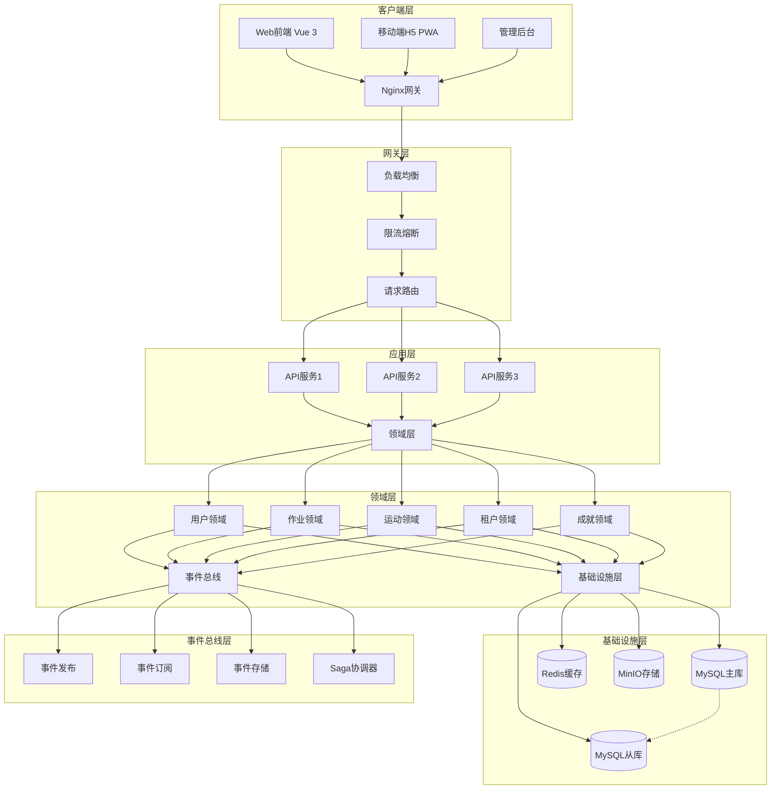

# CoachAI 技术架构详细设计

## 第 1 章 文档概述

### 1.1 文档目的
本文档旨在为CoachAI项目提供全面的技术架构详细设计指导，确保开发团队对系统架构、技术选型、模块设计、接口规范等有统一的理解和遵循。

### 1.2 文档范围
- **技术范围**：Python后端、Vue前端、MySQL数据库、部署运维
- **功能范围**：用户认证、租户管理、作业批改、运动识别等核心功能
- **非功能范围**：性能、安全、高可用、可扩展性设计
- **架构范围**：DDD（领域驱动设计）、EDA（事件驱动架构）

### 1.3 读者对象
- **开发工程师**：了解系统架构、模块设计、编码规范
- **测试工程师**：了解系统功能、接口设计、测试策略
- **运维工程师**：了解部署架构、监控方案、运维流程
- **技术负责人**：了解整体技术架构、技术选型、风险评估
- **产品经理**：了解技术实现约束、功能可行性

### 1.4 术语与缩写解释

| 术语/缩写 | 全称 | 解释 |
|-----------|------|------|
| **SaaS** | Software as a Service | 软件即服务，多租户云服务模式 |
| **OCR** | Optical Character Recognition | 光学字符识别，用于作业批改 |
| **PWA** | Progressive Web App | 渐进式Web应用，支持离线功能 |
| **JWT** | JSON Web Token | JSON Web令牌，用于用户认证 |
| **RESTful** | Representational State Transfer | 表述性状态转移，API设计风格 |
| **ORM** | Object-Relational Mapping | 对象关系映射，数据库操作框架 |
| **DDD** | Domain-Driven Design | 领域驱动设计，软件设计方法 |
| **EDA** | Event-Driven Architecture | 事件驱动架构，系统架构模式 |
| **CI/CD** | Continuous Integration/Deployment | 持续集成/持续部署 |
| **MVP** | Minimum Viable Product | 最小可行产品 |
| **WebRTC** | Web Real-Time Communication | 网页实时通信，用于音视频传输 |
| **AI** | Artificial Intelligence | 人工智能，用于运动识别和作业分析 |

### 1.5 参考资料
1. **产品文档**：
   - `docs/pm/CoachAI业务需求文档（BRD）.md`
   - `docs/pm/CoachAI产品需求文档（PRD）.md`
   - `docs/pm/CoachAI项目产品愿景.md`

2. **技术文档**：
   - `docs/rd/CoachAI技术架构概要设计.md`
   - `docs/rd/CoachAI技术方案实施指南.md`
   - `docs/rd/CoachAI API接口设计.md`
   - `docs/rd/CoachAI部署运维指南.md`

3. **规范文档**：
   - `.rules/coding-style.md` - 项目编码规范
   - `pyproject.toml` - Python项目配置
   - `package.json` - 前端项目配置

4. **外部参考**：
   - Python官方文档：https://docs.python.org/3.12/
   - Tornado文档：https://www.tornadoweb.org/
   - Vue 3文档：https://vuejs.org/
   - MySQL 5.8文档：https://dev.mysql.com/doc/

### 1.6 开发约定

#### 1.6.1 Python版本规范
- **主版本**：Python 3.12.0+
- **虚拟环境**：使用`venv`创建隔离环境
- **依赖管理**：使用`requirements.txt`和`requirements-dev.txt`
- **版本锁定**：生产环境依赖版本需明确指定

#### 1.6.2 编码规范（PEP8扩展）
- **基础规范**：遵循PEP8 Python编码规范
- **项目规范**：严格遵循`.rules/coding-style.md`文件定义
- **注释规范**：所有代码注释必须使用中文编写
- **类型注解**：强制使用类型注解，提高代码可读性
- **文档字符串**：所有函数、类、模块必须有中文文档字符串

#### 1.6.3 接口命名/文件命名规范
- **后端文件**：小写蛇形命名（`user_service.py`, `homework_handler.py`）
- **前端文件**：大驼峰命名（`UserLogin.vue`, `HomeworkList.vue`）
- **数据库表**：统一前缀`coach_ai_` + 小写蛇形命名（`coach_ai_users`）
- **API接口**：RESTful风格，小写蛇形（`/api/v1/users/{id}`）
- **Git分支**：功能分支`feature/功能名`，修复分支`fix/问题描述`

#### 1.6.4 版本管理规范
- **Git工作流**：采用Git Flow工作流
- **提交信息**：遵循Conventional Commits规范
- **版本号**：遵循语义化版本控制（SemVer）
- **代码审查**：所有代码必须经过Code Review才能合并
- **分支保护**：main分支受保护，禁止直接推送

## 第 2 章 项目整体说明

### 2.1 项目业务背景
CoachAI是一个面向中国家庭的智能教育管理SaaS平台，旨在帮助家长轻松管理子女的学习和运动。随着教育信息化和家庭教育需求的增长，家长面临作业批改困难、运动监督不足、时间精力有限等痛点。本项目通过AI技术（OCR识别、动作识别）和硬件外设（摄像头、麦克风）集成，为家长提供一站式的子女教育管理解决方案。

### 2.2 核心功能与业务目标

#### 2.2.1 核心功能
1. **作业批改系统**：
   - 作业图片上传与OCR识别
   - 自动批改与错题分析
   - 知识点总结与学习建议

2. **运动识别系统**：
   - 实时运动计数（跳绳、俯卧撑等）
   - 姿势分析与纠正指导
   - 运动数据统计与报告

3. **家庭管理系统**：
   - 多成员家庭账户管理
   - 学习运动进度跟踪
   - 成就系统与激励体系

#### 2.2.2 业务目标
- **短期目标**（3个月）：完成MVP版本，获取100个种子用户
- **中期目标**（6个月）：功能完善，用户增长至1000个家庭
- **长期目标**（12个月）：平台化运营，建立教育生态

### 2.3 技术选型总原则
1. **成熟稳定**：选择经过生产验证的技术，降低技术风险
2. **开发效率**：选择生态丰富、开发效率高的技术栈
3. **性能优先**：针对实时音视频处理选择高性能框架
4. **成本控制**：MVP阶段简化架构，避免过度设计
5. **扩展性**：设计支持水平扩展的架构，应对用户增长
6. **架构先进**：采用DDD和EDA架构，提高系统可维护性

### 2.4 核心技术栈清单

#### 2.4.1 Web框架
- **主框架**：Tornado 6.4
- **选择理由**：
  - 异步非阻塞，适合高并发实时应用
  - 原生WebSocket支持，适合硬件实时通信
  - 轻量级，启动快速，资源占用少
- **备选方案**：FastAPI（功能丰富）、Django（生态完善）

#### 2.4.2 ASGI/WSGI服务器
- **开发环境**：Tornado内置服务器
- **生产环境**：Gunicorn + Tornado Worker
- **配置示例**：
  ```bash
  gunicorn code.main:app \
    --workers=4 \
    --worker-class=tornado \
    --bind=0.0.0.0:8000 \
    --timeout=120 \
    --access-logfile=-
  ```

#### 2.4.3 ORM框架
- **主框架**：SQLAlchemy 2.0 + Alembic
- **选择理由**：
  - 功能强大，支持复杂查询
  - 异步支持良好
  - 迁移工具完善（Alembic）
  - 支持DDD领域模型设计

#### 2.4.4 数据库
- **主数据库**：MySQL 5.8
- **选择理由**：
  - 成熟稳定，生产验证充分
  - 当前环境支持版本
  - 成本可控，运维简单
- **配置要求**：
  - 字符集：utf8mb4
  - 排序规则：utf8mb4_unicode_ci
  - 存储引擎：InnoDB

#### 2.4.5 前端技术栈
- **核心框架**：Vue 3（纯脚本，无打包编译）
- **UI框架**：Element Plus（移动端适配）
- **HTTP客户端**：Axios
- **状态管理**：Vuex/Pinia（可选）
- **路由管理**：Vue Router（可选）
- **特点**：
  - 无需Node.js编译，直接浏览器运行
  - 与后端代码一起发布，简化部署
  - 支持模块化开发，保持前后端分离

#### 2.4.6 缓存（可选）
- **MVP阶段**：Python内存缓存（`lru_cache`）
- **成长阶段**：Redis 7.0
- **缓存策略**：
  - 用户会话数据
  - 频繁查询结果
  - 配置信息缓存

#### 2.4.7 异步任务
- **MVP阶段**：Tornado异步任务
- **成长阶段**：Celery + Redis
- **任务类型**：
  - OCR识别任务
  - 运动分析任务
  - 报告生成任务

#### 2.4.8 日志/配置/工具库
- **日志系统**：Python logging + structlog
- **配置管理**：Pydantic Settings + 环境变量
- **工具库**：
  - 数据验证：Pydantic
  - HTTP客户端：aiohttp
  - 日期时间：python-dateutil
  - 安全加密：bcrypt, cryptography

#### 2.4.9 测试框架
- **单元测试**：pytest + pytest-asyncio
- **接口测试**：pytest + aiohttp
- **测试覆盖率**：pytest-cov（目标>80%）

#### 2.4.10 部署工具
- **容器化**：Docker + Docker Compose
- **镜像管理**：Docker Hub / 私有仓库
- **编排工具**：Docker Compose（生产考虑K8s）

## 第 3 章 整体技术架构设计

### 3.1 架构设计目标

#### 3.1.1 高可用
- **目标**：系统可用性达到99.9%
- **措施**：
  - 无状态应用设计，支持水平扩展
  - 数据库主从复制，读写分离
  - 负载均衡，故障自动转移
  - 健康检查，自动恢复

#### 3.1.2 可扩展
- **目标**：支持从100到10万用户平滑扩展
- **措施**：
  - 微服务就绪的模块化设计
  - 数据库分片方案设计
  - 缓存层隔离，减少数据库压力
  - 异步处理，提高吞吐量

#### 3.1.3 易维护
- **目标**：新成员1周内可上手开发
- **措施**：
  - 清晰的代码结构和文档
  - 统一的编码规范和工具链
  - 完善的测试覆盖和CI/CD
  - 详细的监控和日志

#### 3.1.4 高性能
- **目标**：API响应时间<100ms，支持1000并发
- **措施**：
  - Tornado异步框架
  - 数据库查询优化
  - 多级缓存策略
  - CDN静态资源加速

### 3.2 系统分层架构（DDD + EDA）

```
┌─────────────────────────────────────────────────────────┐
│                   表现层 (Presentation Layer)            │
│   ┌─────────────┐  ┌─────────────┐  ┌─────────────┐    │
│   │   Web前端    │  │ 移动端H5    │  │  管理后台    │    │
│   │  (Vue 3)    │  │ (PWA)       │  │ (Element+)  │    │
│   └──────┬──────┘  └──────┬──────┘  └──────┬──────┘    │
│          │                 │                 │          │
└──────────┼─────────────────┼─────────────────┼──────────┘
           │                 │                 │
┌──────────┼─────────────────┼─────────────────┼──────────┐
│                   网关层 (Gateway Layer)                  │
│   ┌──────────────────────────────────────────────┐      │
│   │              Nginx反向代理                    │      │
│   │        • HTTPS终止                           │      │
│   │        • 请求路由                            │      │
│   │        • 负载均衡                            │      │
│   │        • 限流熔断                            │      │
│   └──────────────────────────────────────────────┘      │
└──────────────────────────┬───────────────────────────────┘
                           │
┌──────────────────────────┼───────────────────────────────┐
│                   应用层 (Application Layer)              │
│   ┌─────────────┐  ┌─────────────┐  ┌─────────────┐    │
│   │  API服务1    │  │  API服务2    │  │  API服务3    │    │
│   │ (Tornado)   │  │ (Tornado)   │  │ (Tornado)   │    │
│   └──────┬──────┘  └──────┬──────┘  └──────┬──────┘    │
│          │                 │                 │          │
└──────────┼─────────────────┼─────────────────┼──────────┘
           │                 │                 │
┌──────────┼─────────────────┼─────────────────┼──────────┐
│                   领域层 (Domain Layer)                   │
│   ┌──────────────────────────────────────────────┐      │
│   │           领域模型聚合层                      │      │
│   │  • 用户领域      • 作业领域      • 运动领域     │      │
│   │  • 租户领域      • 成就领域      • 文件领域     │      │
│   │  • 事件发布      • 领域服务      • 仓储接口     │      │
│   └──────────────────────────────────────────────┘      │
└──────────────────────────┬───────────────────────────────┘
                           │
┌──────────────────────────┼───────────────────────────────┐
│                   基础设施层 (Infrastructure Layer)       │
│   ┌─────────────┐  ┌─────────────┐  ┌─────────────┐    │
│   │   MySQL      │  │   Redis     │  │  对象存储    │    │
│   │  (主从)      │  │  (集群)     │  │  (MinIO)    │    │
│   └──────┬──────┘  └──────┬──────┘  └──────┬──────┘    │
│          │                 │                 │          │
└──────────┼─────────────────┼─────────────────┼──────────┘
           │                 │                 │
┌──────────┼─────────────────┼─────────────────┼──────────┐
│                   事件总线层 (Event Bus Layer)           │
│   ┌──────────────────────────────────────────────┐      │
│   │             事件驱动架构                      │      │
│   │  • 事件发布/订阅                            │      │
│   │  • 事件存储                                │      │
│   │  • 事件处理                                │      │
│   │  • Saga模式                                │      │
│   └──────────────────────────────────────────────┘      │
└─────────────────────────────────────────────────────────┘
```

### 3.3 整体架构图



### 3.4 架构核心特点

#### 3.4.1 DDD领域驱动设计
- **领域模型**：用户、租户、作业、运动等核心领域
- **聚合根**：每个领域有明确的聚合根，保证业务一致性
- **领域服务**：封装复杂业务逻辑，保持领域模型纯净
- **仓储模式**：抽象数据访问，支持多种数据源
- **领域事件**：通过事件实现领域间解耦

#### 3.4.2 EDA事件驱动架构
- **事件发布/订阅**：松耦合的组件通信方式
- **事件溯源**：通过事件序列重建系统状态
- **Saga模式**：分布式事务管理
- **CQRS**：命令查询职责分离，优化读写性能
- **最终一致性**：通过事件实现数据最终一致性

#### 3.4.3 前后端分离但统一部署
- **前端架构**：Vue 3纯脚本，无需编译打包
- **后端架构**：Tornado异步Web框架
- **统一部署**：前后端代码一起发布，简化运维
- **API通信**：前端通过Ajax调用后端RESTful API
- **静态资源**：前端资源由Nginx直接提供

#### 3.4.4 SaaS多租户
- **数据隔离**：数据库表级隔离（tenant_id字段）
- **资源配额**：租户级存储、成员、API调用限制
- **配置独立**：每个租户可独立配置功能开关
- **计费灵活**：基于订阅计划的差异化功能

#### 3.4.5 移动端优先
- **PWA支持**：渐进式Web应用，类原生体验
- **离线功能**：Service Worker支持离线数据同步
- **硬件访问**：优化摄像头、麦克风、传感器访问
- **性能优化**：针对移动网络和设备深度优化

### 3.5 系统交互流程

#### 3.5.1 作业批改流程（DDD + EDA）
```
前端 (Vue 3) → 网关 (Nginx) → API服务 (Tornado) → 命令处理器 → 领域层 → 事件发布
     ↑              ↑              ↑              ↑          ↑          ↑
   用户界面        负载均衡       请求处理       命令验证    业务逻辑    事件通知
     ↓              ↓              ↓              ↓          ↓          ↓
1. 拍照上传 → 2. 请求路由 → 3. 参数验证 → 4. 创建命令 → 5. 处理命令 → 6. 发布事件
     ↓              ↓              ↓              ↓          ↓          ↓
7. 显示进度 ← 8. 返回任务ID ← 9. 返回结果 ← 10. 保存聚合 ← 11. 持久化 ← 12. 事件存储
     ↓              ↓              ↓              ↓          ↓          ↓
13.轮询结果 → 14.查询状态 → 15.查询仓储 → 16.获取聚合 → 17.返回数据 → 18.事件处理
```

#### 3.5.2 运动识别流程（实时+EDA）
```
移动端H5 → WebRTC信令 → Tornado服务 → 命令处理器 → 领域层 → 实时事件
    ↑           ↑           ↑           ↑           ↑          ↑
  摄像头       信令交换     连接管理    命令创建    业务逻辑    事件流
    ↓           ↓           ↓           ↓           ↓          ↓
1.开启摄像头 → 2.建立连接 → 3.创建会话 → 4.开始命令 → 5.处理命令 → 6.发布开始事件
    ↓           ↓           ↓           ↓           ↓          ↓
7.实时视频 → 8.传输帧 → 9.接收帧 → 10.分析命令 → 11.分析逻辑 → 12.发布分析事件
    ↓           ↓           ↓           ↓           ↓          ↓
13.显示计数 ← 14.返回结果 ← 15.返回数据 ← 16.更新聚合 ← 17.保存状态 ← 18.事件处理
    ↓           ↓           ↓           ↓           ↓          ↓
19.结束运动 → 20.关闭连接 → 21.结束命令 → 22.结束逻辑 → 23.发布结束事件 → 24.最终处理
```

#### 3.5.3 用户认证流程（DDD）
```
前端应用 → 认证中间件 → 命令处理器 → 用户领域 → 事件发布 → 通知领域
    ↑          ↑          ↑          ↑          ↑          ↑
  登录界面    Token验证   命令验证    业务逻辑    事件通知    通知处理
    ↓          ↓          ↓          ↓          ↓          ↓
1.输入凭证 → 2.提取Token → 3.创建命令 → 4.验证用户 → 5.发布事件 → 6.发送通知
    ↓          ↓          ↓          ↓          ↓          ↓
7.显示错误 ← 8.返回错误 ← 9.验证失败 ← 10.用户无效 ← 11.失败事件 ← 12.错误通知
    ↓          ↓          ↓          ↓          ↓          ↓
13.跳转首页 ← 14.返回用户 ← 15.验证成功 ← 16.用户有效 ← 17.成功事件 ← 18.欢迎通知
```

## 第 4 章 系统分层详细设计

### 4.1 项目目录结构设计

根据要求，项目源代码保存在`code`目录下，具体结构如下：

```
code/
├── main.py                    # 应用入口文件
├── requirements.txt           # Python依赖文件
├── pyproject.toml            # Python项目配置
├── deploy/                   # Docker部署文件
│   ├── Dockerfile           # Docker镜像构建文件
│   ├── docker-compose.yml   # Docker Compose配置
│   ├── nginx/              # Nginx配置
│   │   ├── nginx.conf
│   │   └── ssl/
│   └── scripts/            # 部署脚本
│       ├── start.sh
│       ├── stop.sh
│       └── healthcheck.sh
├── tornado/                  # Tornado后端核心
│   ├── __init__.py
│   ├── settings.py          # 应用配置
│   ├── urls.py              # URL路由配置
│   ├── application.py       # 应用工厂
│   ├── core/                # 核心基础模块
│   │   ├── __init__.py
│   │   ├── middleware.py    # 中间件
│   │   ├── exceptions.py    # 异常处理
│   │   ├── authentication.py # 认证授权
│   │   ├── response.py      # 响应封装
│   │   ├── validator.py     # 参数验证
│   │   └── event_bus.py     # 事件总线
│   ├── modules/             # 按业务拆分模块（DDD领域）
│   │   ├── user/           # 用户领域
│   │   │   ├── __init__.py
│   │   │   ├── commands.py # 命令定义
│   │   │   ├── events.py   # 事件定义
│   │   │   ├── models.py   # 领域模型
│   │   │   ├── services.py # 领域服务
│   │   │   ├── repositories.py # 仓储接口
│   │   │   ├── handlers.py # 命令处理器
│   │   │   └── api.py      # API接口
│   │   ├── tenant/         # 租户领域
│   │   │   ├── __init__.py
│   │   │   ├── commands.py
│   │   │   ├── events.py
│   │   │   ├── models.py
│   │   │   ├── services.py
│   │   │   ├── repositories.py
│   │   │   ├── handlers.py
│   │   │   └── api.py
│   │   ├── homework/       # 作业领域
│   │   │   ├── __init__.py
│   │   │   ├── commands.py
│   │   │   ├── events.py
│   │   │   ├── models.py
│   │   │   ├── services.py
│   │   │   ├── repositories.py
│   │   │   ├── handlers.py
│   │   │   └── api.py
│   │   ├── exercise/       # 运动领域
│   │   │   ├── __init__.py
│   │   │   ├── commands.py
│   │   │   ├── events.py
│   │   │   ├── models.py
│   │   │   ├── services.py
│   │   │   ├── repositories.py
│   │   │   ├── handlers.py
│   │   │   └── api.py
│   │   └── achievement/    # 成就领域
│   │       ├── __init__.py
│   │       ├── commands.py
│   │       ├── events.py
│   │       ├── models.py
│   │       ├── services.py
│   │       ├── repositories.py
│   │       ├── handlers.py
│   │       └── api.py
│   ├── infrastructure/      # 基础设施层
│   │   ├── __init__.py
│   │   ├── database/       # 数据库相关
│   │   │   ├── __init__.py
│   │   │   ├── pool.py     # 数据库连接池
│   │   │   ├── session.py  # 会话管理
│   │   │   └── migrations/ # 数据库迁移
│   │   ├── cache/          # 缓存相关
│   │   │   ├── __init__.py
│   │   │   ├── redis_client.py
│   │   │   └── memory_cache.py
│   │   ├── storage/        # 存储相关
│   │   │   ├── __init__.py
│   │   │   ├── file_storage.py
│   │   │   └── minio_client.py
│   │   └── external/       # 外部服务
│   │       ├── __init__.py
│   │       ├── ocr_service.py
│   │       ├── ai_service.py
│   │       └── webrtc_service.py
│   └── utils/              # 工具类
│       ├── __init__.py
│       ├── datetime_utils.py
│       ├── string_utils.py
│       ├── encryption_utils.py
│       └── file_utils.py
├── database/                # 数据库相关
│   ├── __init__.py
│   ├── pool.py             # MySQL高级连接池
│   ├── models.py           # ORM模型（SQLAlchemy）
│   ├── repositories/       # 仓储实现
│   │   ├── __init__.py
│   │   ├── user_repository.py
│   │   ├── tenant_repository.py
│   │   ├── homework_repository.py
│   │   ├── exercise_repository.py
│   │   └── achievement_repository.py
│   └── migrations/         # Alembic迁移
│       ├── versions/
│       ├── env.py
│       └── alembic.ini
└── web/                    # 前端代码（Vue 3纯脚本）
    ├── index.html          # 主入口文件
    ├── assets/             # 静态资源
    │   ├── css/
    │   │   ├── app.css
    │   │   ├── components.css
    │   │   └── responsive.css
    │   ├── js/
    │   │   ├── lib/        # 第三方库
    │   │   │   ├── vue.global.js
    │   │   │   ├── element-plus.js
    │   │   │   └── axios.js
    │   │   └── utils/      # 工具函数
    │   │       ├── api.js
    │   │       ├── auth.js
    │   │       └── utils.js
    │   └── images/         # 图片资源
    │       ├── logo.png
    │       ├── icons/
    │       └── avatars/
    ├── components/         # 公共Vue组件
    │   ├── common/         # 通用组件
    │   │   ├── Header.vue
    │   │   ├── Footer.vue
    │   │   ├── Sidebar.vue
    │   │   └── Loading.vue
    │   ├── forms/          # 表单组件
    │   │   ├── InputField.vue
    │   │   ├── SelectField.vue
    │   │   ├── UploadField.vue
    │   │   └── FormValidator.vue
    │   └── ui/             # UI组件
    │       ├── Button.vue
    │       ├── Card.vue
    │       ├── Modal.vue
    │       └── Toast.vue
    ├── pages/              # 按模块对应页面
    │   ├── auth/           # 认证页面
    │   │   ├── Login.vue
    │   │   ├── Register.vue
    │   │   └── ForgotPassword.vue
    │   ├── user/           # 用户页面
    │   │   ├── Profile.vue
    │   │   ├── Settings.vue
    │   │   └── Dashboard.vue
    │   ├── tenant/         # 租户页面
    │   │   ├── CreateTenant.vue
    │   │   ├── TenantList.vue
    │   │   └── TenantDetail.vue
    │   ├── homework/       # 作业页面
    │   │   ├── UploadHomework.vue
    │   │   ├── HomeworkList.vue
    │   │   └── HomeworkDetail.vue
    │   ├── exercise/       # 运动页面
    │   │   ├── StartExercise.vue
    │   │   ├── ExerciseList.vue
    │   │   └── ExerciseDetail.vue
    │   └── achievement/    # 成就页面
    │       ├── AchievementList.vue
    │       └── AchievementDetail.vue
    ├── config.js           # Vue全局配置
    ├── router.js           # 前端路由配置
    ├── store.js            # 状态管理配置
    └── app.js              # Vue应用初始化
```

### 4.2 接入层设计

#### 4.2.1 反向代理（Nginx）
```nginx
# nginx.conf 核心配置
http {
    # 上游服务配置
    upstream coachai_backend {
        least_conn;  # 最少连接负载均衡
        server 127.0.0.1:8001 max_fails=3 fail_timeout=30s;
        server 127.0.0.1:8002 max_fails=3 fail_timeout=30s;
        server 127.0.0.1:8003 max_fails=3 fail_timeout=30s;
        keepalive 32;
    }
    
    # WebSocket上游
    upstream coachai_websocket {
        ip_hash;  # WebSocket需要会话保持
        server 127.0.0.1:8001;
        server 127.0.0.1:8002;
        server 127.0.0.1:8003;
    }
    
    server {
        listen 80;
        server_name coachai.example.com;
        
        # HTTPS重定向
        return 301 https://$server_name$request_uri;
    }
    
    server {
        listen 443 ssl http2;
        server_name coachai.example.com;
        
        # SSL配置
        ssl_certificate /etc/nginx/ssl/coachai.crt;
        ssl_certificate_key /etc/nginx/ssl/coachai.key;
        ssl_protocols TLSv1.2 TLSv1.3;
        ssl_ciphers ECDHE-RSA-AES256-GCM-SHA512:DHE-RSA-AES256-GCM-SHA512;
        ssl_prefer_server_ciphers off;
        
        # 安全头部
        add_header X-Frame-Options DENY;
        add_header X-Content-Type-Options nosniff;
        add_header X-XSS-Protection "1; mode=block";
        
        # 前端静态资源
        location / {
            root /var/www/coachai/web;
            index index.html;
            try_files $uri $uri/ /index.html;
            
            # 缓存策略
            expires 1h;
            add_header Cache-Control "public, max-age=3600";
        }
        
        # 静态资源服务
        location /assets/ {
            root /var/www/coachai/web;
            expires 1y;
            add_header Cache-Control "public, immutable";
        }
        
        # API路由
        location /api