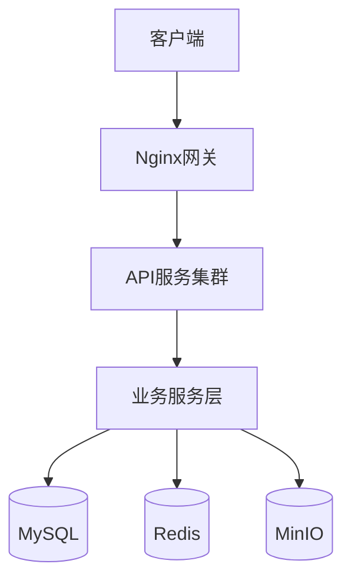

# CoachAI 技术架构详细设计

## 第 1 章 文档概述
### 1.1 文档目的
为CoachAI项目提供全面的技术架构详细设计指导，确保开发团队对系统架构、技术选型、模块设计、接口规范等有统一的理解和遵循。

### 1.2 文档范围
- 技术范围：Python后端、Vue前端、MySQL数据库、部署运维
- 功能范围：用户认证、租户管理、作业批改、运动识别等核心功能
- 非功能范围：性能、安全、高可用、可扩展性设计

### 1.3 读者对象
- 开发工程师、测试工程师、运维工程师
- 技术负责人、产品经理

### 1.4 术语与缩写解释
| 术语 | 解释 |
|------|------|
| SaaS | 软件即服务，多租户云服务模式 |
| OCR | 光学字符识别，用于作业批改 |
| PWA | 渐进式Web应用，支持离线功能 |
| JWT | JSON Web令牌，用于用户认证 |
| RESTful | API设计风格 |
| ORM | 对象关系映射，数据库操作框架 |

### 1.5 参考资料
- 产品文档：BRD、PRD、产品愿景
- 技术文档：技术架构概要设计、API设计、部署指南
- 规范文档：coding-style.md、pyproject.toml

### 1.6 开发约定
#### 1.6.1 Python版本规范
- Python 3.12.0+，使用venv虚拟环境
- 依赖管理：requirements.txt + requirements-dev.txt

#### 1.6.2 编码规范（PEP8扩展）
- 严格遵循`.rules/coding-style.md`
- 所有代码注释使用中文编写
- 强制使用类型注解

#### 1.6.3 接口命名/文件命名规范
- 后端文件：小写蛇形命名（user_service.py）
- 前端文件：大驼峰命名（UserLogin.vue）
- 数据库表：coach_ai_前缀 + 小写蛇形命名
- API接口：RESTful风格

#### 1.6.4 版本管理规范
- Git Flow工作流
- Conventional Commits规范
- 语义化版本控制（SemVer）

## 第 2 章 项目整体说明
### 2.1 项目业务背景
CoachAI是面向中国家庭的智能教育管理SaaS平台，帮助家长管理子女学习和运动，解决作业批改困难、运动监督不足等痛点。

### 2.2 核心功能与业务目标
#### 核心功能：
1. 作业批改系统（OCR识别、自动批改）
2. 运动识别系统（实时计数、姿势分析）
3. 家庭管理系统（多成员、进度跟踪）

#### 业务目标：
- 短期（3个月）：MVP版本，100种子用户
- 中期（6个月）：功能完善，1000家庭用户
- 长期（12个月）：平台化运营，教育生态

### 2.3 技术选型总原则
1. 成熟稳定：生产验证技术
2. 开发效率：生态丰富，效率高
3. 性能优先：适合实时音视频处理
4. 成本控制：MVP简化架构
5. 扩展性：支持水平扩展

### 2.4 核心技术栈清单
#### Web框架：Tornado 6.4
- 异步非阻塞，适合高并发
- 原生WebSocket支持
- 轻量级，启动快速

#### 服务器：Gunicorn + Tornado Worker
- 开发：Tornado内置服务器
- 生产：Gunicorn多进程

#### ORM框架：SQLAlchemy 2.0 + Alembic
- 功能强大，支持复杂查询
- 异步支持良好
- 迁移工具完善

#### 数据库：MySQL 5.8
- 成熟稳定，生产验证
- 当前环境支持版本
- 成本可控，运维简单

#### 缓存（可选）：
- MVP阶段：Python内存缓存
- 成长阶段：Redis 7.0

#### 异步任务：
- MVP阶段：Tornado异步任务
- 成长阶段：Celery + Redis

#### 日志/配置/工具库：
- 日志：Python logging + structlog
- 配置：Pydantic Settings + 环境变量
- 工具：Pydantic、aiohttp、bcrypt

#### 测试框架：
- 单元测试：pytest + pytest-asyncio
- 接口测试：pytest + aiohttp
- 覆盖率：pytest-cov（>80%）

#### 部署工具：
- 容器化：Docker + Docker Compose
- 编排：Docker Compose（生产考虑K8s）

## 第 3 章 整体技术架构设计
### 3.1 架构设计目标
#### 高可用（99.9%）
- 无状态应用设计
- 数据库主从复制
- 负载均衡，故障转移

#### 可扩展（100→10万用户）
- 微服务就绪模块化
- 数据库分片方案
- 缓存层隔离

#### 易维护（1周上手）
- 清晰代码结构和文档
- 统一编码规范和工具链
- 完善测试覆盖和CI/CD

#### 高性能（<100ms，1000并发）
- Tornado异步框架
- 数据库查询优化
- 多级缓存策略

### 3.2 系统分层架构
```
表现层（Web前端、移动H5、管理后台）
    ↓
网关层（Nginx反向代理、负载均衡）
    ↓
应用层（API服务集群）
    ↓
服务层（业务服务聚合）
    ↓
数据层（MySQL、Redis、对象存储）
```

### 3.3 整体架构图


### 3.4 架构核心特点
1. **异步高性能**：Tornado事件循环，适合实时应用
2. **SaaS多租户**：数据库表级隔离，租户资源配额
3. **移动端优先**：PWA支持，离线功能，硬件访问优化
4. **硬件外设集成**：WebRTC实时通信，设备兼容性处理
5. **渐进式演进**：MVP简化，平滑升级，扩展就绪

### 3.5 系统交互流程
#### 作业批改流程：
前端 → Nginx → API服务 → 业务服务 → 数据存储 → OCR识别 → 结果返回

#### 运动识别流程：
移动端 → WebRTC → AI服务 → 实时分析 → 数据存储 → 反馈前端

#### 用户认证流程：
前端 → 认证中间件 → 用户服务 → 数据库/缓存 → Token返回

## 第 4 章 系统分层详细设计
### 4.1 接入层设计
#### 4.1.1 反向代理（Nginx）
- HTTPS终止，请求路由，负载均衡
- WebSocket支持，限流熔断配置
- 静态资源服务，CDN集成

#### 4.1.2 静态资源部署
- CDN加速，版本控制，压缩优化
- 缓存策略：HTML不缓存，JS/CSS长期缓存

#### 4.1.3 请求路由/负载均衡
- 最少连接算法，健康检查
- 会话保持，故障转移

#### 4.1.4 跨域配置
- CORS头部配置，预检请求处理
- 安全头部设置

#### 4.1.5 请求限流/熔断
- 基于IP和API端点的限流
- 熔断机制，防止雪崩

### 4.2 应用层（Web核心层）设计
#### 4.2.1 路由规则设计
- 模块化路由配置，版本管理
- 路由分组，权限控制

#### 4.2.2 中间件设计
- 认证中间件：JWT Token验证
- 租户中间件：租户上下文提取
- 日志中间件：请求响应日志记录
- 异常中间件：统一异常处理

#### 4.2.3 视图/控制器层
- 基础处理器类，提供通用功能
- 业务处理器，处理具体业务逻辑
- 参数验证，业务逻辑封装

#### 4.2.4 请求参数校验
- Pydantic数据验证
- 自定义验证规则
- 错误信息格式化

#### 4.2.5 统一响应封装
- 成功响应格式
- 错误响应格式
- 分页响应格式

### 4.3 业务服务层设计
#### 4.3.1 业务逻辑拆分
- 用户服务：用户管理、认证授权
- 作业服务：作业上传、OCR识别、批改分析
- 运动服务：运动记录、实时分析、姿势识别
- 租户服务：租户管理、配额控制、配置管理

#### 4.3.2 通用服务模块
- 文件服务：文件上传下载、存储管理
- 通知服务：系统通知、实时推送、邮件通知
- 配置服务：配置管理、动态配置更新

#### 4.3.3 异步任务服务（Celery）
- OCR识别任务：异步处理作业图片
- 运动分析任务：批量处理运动数据
- 报告生成任务：生成统计报告
- 清理任务：清理临时文件、旧日志

#### 4.3.4 定时任务服务
- 每日任务：清理临时文件、生成报告
- 每小时任务：检查租户配额、健康检查
- 每周任务：清理旧日志、数据备份

### 4.4 数据访问层设计
#### 4.4.1 ORM模型设计
- 基础模型类：提供通用字段和方法
- 用户模型：用户信息、认证数据
- 租户模型：租户信息、配置数据
- 作业模型：作业信息、批改结果
- 运动模型：运动记录、分析数据

#### 4.4.2 数据库读写操作
- 基础仓库类：通用CRUD操作
- 查询构建器：复杂查询构建
- 事务管理：事务封装、错误处理

#### 4.4.3 事务管理
- 事务装饰器：自动事务管理
- 嵌套事务：支持事务嵌套
- 事务隔离：配置事务隔离级别

#### 4.4.4 数据缓存逻辑
- 缓存策略：读写穿透、缓存 aside
- 缓存失效：时间失效、事件失效
- 缓存预热：启动时预热热点数据

### 4.5 基础设施层设计
#### 4.5.1 配置管理
- 多环境配置：开发、测试、生产
- 配置验证：配置项类型验证
- 热更新：运行时配置更新

#### 4.5.2 日志系统
- 结构化日志：JSON格式，便于分析
- 日志分级：DEBUG、INFO、WARNING、ERROR
- 日志聚合：集中日志收集和分析

#### 4.5.3 异常统一处理
- 业务异常：自定义业务异常类
- 系统异常：系统级异常处理
- 异常转换：底层异常转换为业务异常

#### 4.5.4 工具类封装
- 日期时间工具：时间格式化、计算
- 字符串工具：字符串处理、验证
- 加密工具：密码加密、数据加密

#### 4.5.5 消息队列（如需要）
- RabbitMQ/Kafka：异步消息处理
- 消息确认：确保消息可靠传递
- 死信队列：处理失败消息

## 第 5 章 核心功能模块详细设计
### 5.1 用户认证与授权模块
#### 5.1.1 认证方式
- JWT Token认证
- 多因素认证（MFA）
- 社交登录（微信、支付宝）

#### 5.1.2 授权机制
- 基于角色的访问控制（RBAC）
- 基于资源的权限控制
- 租户级权限隔离

#### 5.1.3 会话管理
- Token刷新机制
- 会话超时控制
- 并发登录控制

### 5.2 权限管理模块
#### 5.2.1 权限模型
- 用户-角色-权限模型
- 权限继承和覆盖
- 动态权限配置

#### 5.2.2 权限验证
- 接口级权限验证
- 数据级权限验证
- 操作级权限验证

### 5.3 核心业务模块
#### 5.3.1 作业批改模块
- 图片上传和预处理
- OCR文字识别
- 自动批改算法
- 错题分析和知识点提取

#### 5.3.2 运动识别模块
- 实时视频流处理
- 动作识别算法
- 姿势分析和纠正
- 运动数据统计

#### 5.3.3 家庭管理模块
- 家庭成员管理
- 学习进度跟踪
- 运动数据统计
- 成就系统

### 5.4 文件管理模块
#### 5.4.1 文件上传
- 分片上传，支持大文件
- 断点续传
- 文件类型验证

#### 5.4.2 文件存储
- 本地存储和云存储
- 文件去重
- 存储配额管理

#### 5.4.3 文件处理
- 图片压缩和裁剪
- 视频转码
- 缩略图生成

### 5.5 消息通知模块
#### 5.5.1 通知类型
- 系统通知
- 业务通知
- 实时通知

#### 5.5.2 通知渠道
- 站内信
- 邮件通知
- 短信通知
- 微信通知

#### 5.5.3 通知模板
- 模板管理
- 变量替换
- 多语言支持

### 5.6 第三方接口集成模块
#### 5.6.1 OCR服务集成
- 百度OCR、腾讯OCR
- 服务降级和熔断
- 结果缓存

#### 5.6.2 支付服务集成
- 微信支付、支付宝
- 支付回调处理
- 对账和退款

#### 5.6.3 短信服务集成
- 阿里云短信、腾讯云短信
- 发送频率限制
- 发送状态跟踪

## 第 6 章 接口设计
### 6.1 API设计规范（RESTful）
- 资源命名：名词复数，小写蛇形
- HTTP方法：GET、POST、PUT、DELETE
- 状态码：标准HTTP状态码
- 版本管理：URL路径版本控制

### 6.2 统一请求/响应格式
#### 请求格式：
```json
{
  "param1": "value1",
  "param2": "value2"
}
```

#### 成功响应：
```json
{
  "code": "SUCCESS",
  "message": "操作成功",
  "data": {},
  "timestamp": "2026-03-26T14:42:00Z"
}
```

#### 错误响应：
```json
{
  "code": "ERROR_CODE",
  "message": "错误描述",
  "details": {},
  "timestamp": "2026-03-26T14:42:00Z"
}
```

### 6.3 接口版本管理
- URL路径版本：/api/v1/, /api/v2/
- 请求头版本：Accept: application/vnd.coachai.v1+json
- 版本兼容：向后兼容，逐步废弃

### 6.4 接口文档（Swagger/Redoc）
- OpenAPI 3.0规范
- 自动生成API文档
- 在线测试工具

### 6.5 核心接口清单
#### 认证相关：
- POST /api/v1/auth/register - 用户注册
- POST /api/v1/auth/login - 用户登录
- POST /api/v1/auth/refresh - 刷新Token
- POST /api/v1/auth/logout - 用户登出

#### 用户管理：
- GET /api/v1/users - 用户列表
- GET /api/v1/users/{id} - 用户详情
- PUT /api/v1/users/{id} - 更新用户
- DELETE /api/v1/users/{id} - 删除用户

#### 租户管理：
- POST /api/v1/tenants - 创建租户
- GET /api/v1/tenants - 租户列表
- GET /api/v1/tenants/{id} - 租户详情
- PUT /api/v1/tenants/{id} - 更新租户

#### 作业管理：
- POST /api/v1/homeworks/upload - 上传作业
- GET /api/v1/homeworks - 作业列表
- GET /api/v1/homeworks/{id} - 作业详情
- GET /api/v1/homeworks/{id}/correction - 批改结果

#### 运动管理：
- POST /api/v1/exercises/start - 开始运动
- POST /api/v1/exercises/{id}/stop - 结束运动
- GET /api/v1/exercises - 运动记录列表
- GET /api/v1/exercises/{id} - 运动记录详情

## 第 7 章 数据存储设计
### 7.1 数据库选型与架构
#### 主数据库：MySQL 5.8
- 存储引擎：InnoDB
- 字符集：utf8mb4
- 排序规则：utf8mb4_unicode_ci

#### 数据库架构：
- 主从复制：读写分离
- 分库分表：水平